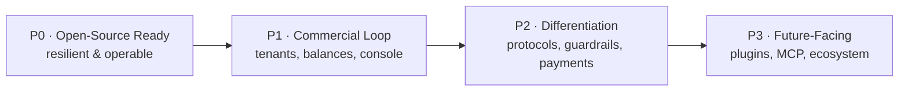

# 03 · Roadmap

> [中文版](zh-CN/03-roadmap.md) · Part of the [ai-gateway documentation suite](README.md)

Four phases, each with a theme, a scope, and **exit criteria** — observable conditions that must all hold before the phase is declared done. Phases are capability milestones, not calendar commitments; they may overlap in development but ship in order.

## P0 · Open-Source Ready — the release gate

**Theme:** a stranger can run this in production and trust it. Nothing publishes to "launch" status until every P0 item lands.

| # | Deliverable | Design doc |
| --- | --- | --- |
| P0-1 | Weighted load balancing (activate `AIProvider.Weight`), retry + failover, circuit breaker with passive health checks | [D01](design/01-routing-and-lb.md) |
| P0-2 | Prometheus `/metrics`, `/healthz`, `/readyz`; Grafana dashboard JSON in-repo | [D05](design/05-observability.md) |
| P0-3 | Management-API authentication: static admin token, then admin API keys | [D04](design/04-multi-tenancy-and-auth.md) |
| P0-4 | Provider API key encryption at rest (close the plaintext gap) | [D06](design/06-security-and-guardrails.md) |
| P0-5 | `docker-compose up` one-command stack (gateway + MySQL + Redis) | [D10](design/10-deployment-and-ops.md) |
| P0-6 | PostgreSQL support alongside MySQL | [D10](design/10-deployment-and-ops.md) |
| P0-7 | Unit tests for `internal/biz` (quota, routing, credits, key cache) + integration tests; GitHub Actions CI (test/lint/build/docker) | [D10](design/10-deployment-and-ops.md) |
| P0-8 | English README, CONTRIBUTING, SECURITY.md, issue/PR templates, OpenAPI spec for management API | [D10](design/10-deployment-and-ops.md) |

**Exit criteria**

- [ ] Killing one of two configured providers causes zero user-visible errors beyond in-flight requests; traffic shifts within the breaker window and shifts back on recovery.
- [ ] `docker compose up` → first successful `/ai/v1/chat/completions` in under 10 minutes on a clean machine, following README only.
- [ ] `curl /metrics` exposes request, latency, token, and breaker series; the shipped Grafana dashboard renders them.
- [ ] No management endpoint responds without credentials.
- [ ] CI green on every PR: `go test ./...` (≥ 60% coverage on `internal/biz`), `golangci-lint`, multi-arch docker build.
- [ ] Full test suite passes against both MySQL and PostgreSQL.

## P1 · Commercial Loop — worth paying for

**Theme:** the reseller archetype can run a prepaid API business; the platform archetype gets chargeback. The console makes both visible.

| # | Deliverable | Design doc |
| --- | --- | --- |
| P1-1 | Tenant → project → key hierarchy; row-level isolation; quota inheritance | [D04](design/04-multi-tenancy-and-auth.md) |
| P1-2 | User accounts + RBAC (owner/admin/member/viewer) on the management plane | [D04](design/04-multi-tenancy-and-auth.md) |
| P1-3 | Balance accounts (prepaid/postpaid), double-entry ledger, freeze→settle deduction on the proxy path, grace-period suspension | [D03](design/03-billing-and-monetization.md) |
| P1-4 | Multi-currency pricing; price tables decoupled from upstream cost; budget alerts | [D03](design/03-billing-and-monetization.md) |
| P1-5 | Cost attribution reports (by tenant/project/key/model/tag) with daily pre-aggregation | [D03](design/03-billing-and-monetization.md) |
| P1-6 | Built-in rule-based PII engine behind the existing `pii.go` stub (block/redact/log) | [D06](design/06-security-and-guardrails.md) |
| P1-7 | Web console MVP: dashboard, keys, providers, audit, usage/billing views, embedded via `embed.FS` | [D08](design/08-web-console.md) |

**Exit criteria**

- [ ] End-to-end reseller flow works from the console: create tenant → recharge balance → issue key → consume → watch balance decrease → hit zero → requests rejected with a billing error → recharge → traffic resumes.
- [ ] Every ledger entry traces to audit log records; ledger sum always equals account balance (invariant enforced by test).
- [ ] A member-role user can view usage but cannot reveal keys or change quotas.
- [ ] Budget alert fires (webhook/email) at the configured threshold.
- [ ] The console performs no action impossible via the documented public API.

## P2 · Differentiation — winning comparisons

**Theme:** capabilities that make ai-gateway the *better* choice, not just a working one.

| # | Deliverable | Design doc |
| --- | --- | --- |
| P2-1 | Outbound protocol adapters: Anthropic, Gemini, Bedrock, Azure OpenAI (streaming included) | [D02](design/02-protocol-adapters.md) |
| P2-2 | Inbound Anthropic Messages API + OpenAI Responses API entrances | [D02](design/02-protocol-adapters.md) |
| P2-3 | Usage normalization layer (cache/reasoning tokens) feeding audit + billing | [D02](design/02-protocol-adapters.md) |
| P2-4 | Exact-match response cache + semantic cache (pluggable vector backend) with cache-aware billing | [D07](design/07-caching-strategies.md) |
| P2-5 | Guardrail pipeline: prompt-injection detection, topic fencing, output safety; external PII engine (gRPC) integration | [D06](design/06-security-and-guardrails.md) |
| P2-6 | OpenTelemetry tracing with W3C context propagation | [D05](design/05-observability.md) |
| P2-7 | Subscription plans, payment gateway abstraction (Stripe / Alipay / WeChat Pay), invoice records | [D03](design/03-billing-and-monetization.md) |
| P2-8 | Console phase 2: billing center, tenant management, model/pricing management, settings | [D08](design/08-web-console.md) |
| P2-9 | OIDC/SSO for the console | [D04](design/04-multi-tenancy-and-auth.md) |

**Exit criteria**

- [ ] A Claude-SDK client and an OpenAI-SDK client both call the same virtual key and land on the same Gemini provider, with correctly normalized usage in audit and billing.
- [ ] Streaming translation adds < 5 ms per chunk at p99.
- [ ] Semantic cache demonstrates ≥ 30% hit rate on a repetitive-workload benchmark, with hits billed per configured policy.
- [ ] A Stripe (or Alipay) recharge completes the webhook→ledger→balance loop with signature verification and idempotent replay.
- [ ] A trace for one request shows spans: auth → route decision → upstream call → settlement.

## P3 · Future-Facing — the ecosystem bet

**Theme:** keep the core small while the surface area grows; be ready for the agentic era.

| # | Deliverable | Design doc |
| --- | --- | --- |
| P3-1 | Extension hook points (pre-request / post-response / on-audit / on-billing); webhook + compile-time plugin registration; WASM evaluation | [D09](design/09-extensibility.md) |
| P3-2 | Event bus: audit/quota/billing events to webhook or Kafka | [D09](design/09-extensibility.md) |
| P3-3 | MCP gateway: MCP server proxying, tool-call audit and governance, agent-session quotas | [D09](design/09-extensibility.md) |
| P3-4 | Batch API and Files API proxying | [D02](design/02-protocol-adapters.md) |
| P3-5 | Helm chart + Kubernetes operator; SQLite single-file demo mode | [D10](design/10-deployment-and-ops.md) |

**Exit criteria**

- [ ] A community-authored provider adapter and a guardrail plugin each ship without modifying core packages.
- [ ] Tool calls flowing through the MCP gateway appear in the audit center with arguments and results, subject to quota.
- [ ] `helm install` produces an HA deployment (3 replicas) passing the P0 failover test.

## Cross-phase invariants

Rules that apply to every phase and take precedence over feature velocity:

1. **No breaking changes to `/ai/v1/*`.** OpenAI compatibility is a public contract from P0 onward.
2. **Migrations are additive.** Existing deployments upgrade with `autoMigrate` alone; destructive schema changes require a versioned migration tool decision first (see [D10](design/10-deployment-and-ops.md)).
3. **Hot-path budget.** Any feature adding > 2 ms p99 to the proxy path must run async or be opt-in.
4. **Docs ship with code.** A feature without design-doc updates and user docs is not done.
5. **Chinese/English parity.** User-facing docs and console strings land in both languages in the same release.
