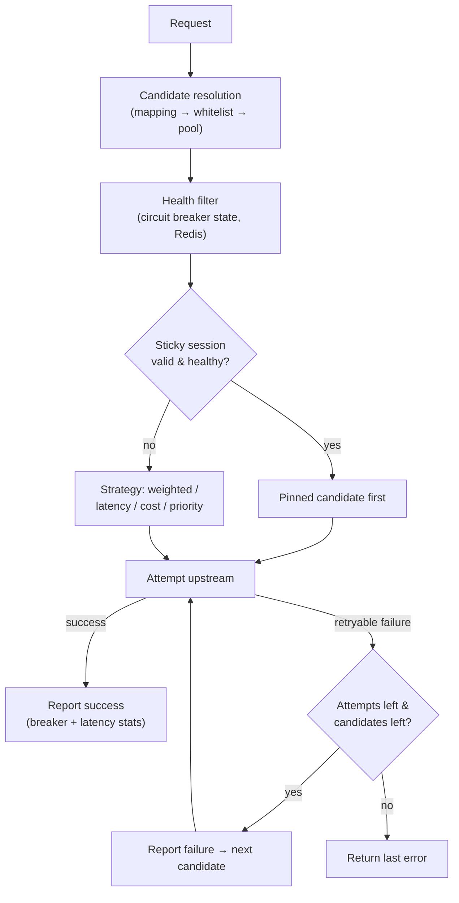
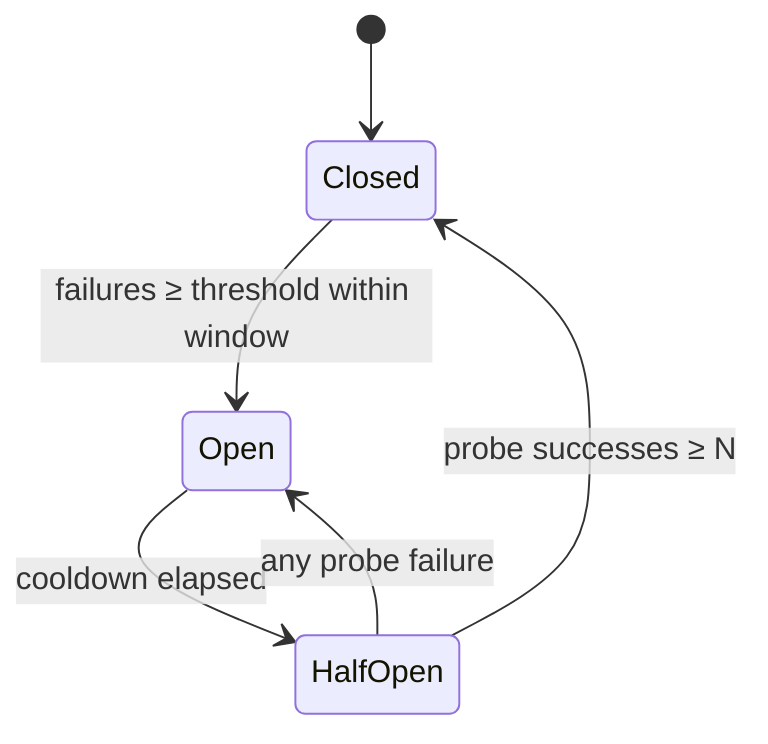

# D01 · Routing & Load Balancing

> [中文版](../zh-CN/design/01-routing-and-lb.md) · Part of the [ai-gateway documentation suite](../README.md)

| | |
| --- | --- |
| **Phase** | P0 (core), latency/cost strategies P1 |
| **Depends on** | [D05 Observability](05-observability.md) for the latency data the routing strategies consume |
| **Depended on by** | [D02 Protocol Adapters](02-protocol-adapters.md) (routing picks the provider, adapters speak to it), [D07 Caching](07-caching-strategies.md) |

## Context

Today the gateway picks providers and models essentially at random:

- `resolveTargetModel()` / `resolveExactTargetModel()` (`internal/biz/gateway.go:804,842`) fall back to `mrand.IntN` over the allowed-model list or the provider's model pool.
- `AIProvider.Weight` (`internal/data/model/provider.go:28`) exists in the schema, defaults to 100, and **is never read anywhere**.
- `AIProvider.IsHealthy()` returns `IsEnabled` verbatim — health is an operator-toggled boolean, not an observed fact.
- `ProxyRequest()` (`internal/biz/gateway.go:486`) makes exactly one upstream attempt; any upstream failure propagates directly to the client.
- Session affinity (`resolveSticky()`, `gateway.go:774`) pins to a provider with no escape hatch when that provider degrades — it only checks `is_enabled` in the DB.

Consequence: a single provider outage is a full outage for every key pinned or routed to it. For a product whose pitch includes "multi-provider load balancing," this is the most important gap to close, and it gates the P0 release ([Roadmap P0-1](../03-roadmap.md)).

## Goals

1. Deterministic, configurable provider/model selection strategies (weighted first; latency- and cost-aware later).
2. Automatic retry and failover across candidates on retryable upstream failures.
3. Circuit breaking driven by passively observed failures, shared across gateway instances.
4. Session affinity that yields gracefully when its pinned provider trips.
5. Zero new infrastructure: state lives in Redis, config lives in MySQL, consistent with existing patterns.

Non-goals: request queueing/shedding beyond the existing concurrency slots; global rate coordination across providers (a provider-level quota is future work).

## Design overview



The key structural change: model resolution stops returning **one** `(model, providerID)` and starts returning an **ordered candidate list**. Everything else (breakers, retries, affinity fallback) composes around that list.

### New biz component: `RouterManager`

Following the `QuotaManager` precedent (`internal/biz/quota.go`): a Wire-provided struct owning Redis-backed state and small Lua scripts, consumed by `GatewayUseCase`.

```go
// internal/biz/router.go
type RouteCandidate struct {
    ProviderID uint
    Model      string
    ViaMapping bool
    Priority   int // lower = preferred tier; same tier ⇒ strategy decides
}

type RouterManager struct { /* rdb, db, logger */ }

// Rank filters unhealthy candidates and orders the rest per the key's strategy.
func (rm *RouterManager) Rank(ctx context.Context, key *model.AIVirtualKey, cands []RouteCandidate) []RouteCandidate

// ReportResult feeds the breaker and the latency EWMA after each attempt.
func (rm *RouterManager) ReportResult(ctx context.Context, providerID uint, model string, outcome AttemptOutcome)

// Healthy exposes breaker state (also consumed by sticky-session fallback and /metrics).
func (rm *RouterManager) Healthy(ctx context.Context, providerID uint) BreakerState
```

## Selection strategies

Strategy is configured per virtual key (new column `routing_strategy` on `AIVirtualKey`, empty = inherit global default `weighted`). Model mappings that name an explicit provider bypass strategy by design — a mapping is an instruction, not a hint.

| Strategy | Behavior | Phase |
| --- | --- | --- |
| `weighted` (default) | Smooth weighted round-robin over candidates in the top priority tier, using `AIProvider.Weight`. Weight 0 = drain (no new traffic, existing affinity honored). | P0 |
| `priority` | Strict ordering by `Priority`; lower tiers only when every provider above is open-circuit. This is the "fallback chain" strategy. | P0 |
| `least_latency` | Prefer lowest EWMA of recent TTFT/latency per `(provider, model)`, jittered to avoid herding. Latency source: the same per-attempt observations exported to Prometheus ([D05](05-observability.md)). | P1 |
| `least_cost` | Prefer lowest effective input+output price from `AIModelItem` pricing (already loaded by `credits.go`). | P1 |

Smooth weighted round-robin state (current effective weights) is kept in a Redis hash per candidate-set hash, mutated by a small Lua script — atomic across instances, and stateless gateway instances stay stateless.

### Fallback chains

A fallback chain is expressed as priority tiers, not a separate concept: candidates carry `Priority`, and `priority` strategy (or breaker exhaustion under any strategy) walks down tiers. Chains are configured on the model mapping (new optional JSON column `fallback_chain` on `AIModelMapping`: ordered `[{provider_id, model}]`). This deliberately reuses the mapping table — the mapping is already "where routing intent lives" per key.

## Health: circuit breaker

### Decision (ADR)

- **Context:** health state must be shared across instances (an instance that never sent traffic to provider X should still know X is down) and must not add a DB dependency to the hot path.
- **Options:** (a) per-instance in-memory breakers; (b) a `ai_provider_health` MySQL table; (c) Redis-backed breaker state + event records in MySQL.
- **Decision:** (c). Redis hash per provider for live state; state *transitions* are recorded through the existing async audit/event pattern (a `RouterEvent` modeled on `QuotaEvent`, `internal/data/model/quota_event.go`) for operator visibility and console timelines.
- **Consequences:** breaker reads add one Redis call per request — mitigated by piggybacking on the existing L1-cache pattern (60 s local TTL is too slow for breakers; use a 1–2 s local TTL micro-cache). If Redis is down, breakers **fail open** (all providers considered healthy) — Redis loss already disables quotas, and per design principle 6, economics/resilience fail open.

### State machine



Redis layout (follows the `ai:gw:` conventions):

```text
ai:gw:cb:{providerID}          # hash: state, fail_count, window_start, opened_at, probe_ok
ai:gw:lat:{providerID}:{model} # hash: ewma_ms, ttft_ewma_ms, updated_at
```

Defaults (per-provider overridable via new JSON column `breaker_config` on `AIProvider`): failure threshold 5 in 30 s, cooldown 30 s, half-open probe quota 3. Counted as failures: connect errors, timeouts, HTTP 5xx, 429. **Not** counted: 4xx other than 429 (those are caller errors), guardrail blocks, quota rejections.

Passive checks are the P0 mechanism. Active probing closes a specific gap in passive-only recovery: `Candidates()` pushes open-breaker providers to the end of the list, and the attempt loop stops at `maxUpstreamAttempts`, so a provider ranked behind enough healthy candidates can go indefinitely without another attempt — and therefore never re-enter half-open — even after its outage clears. A background sweep (`internal/biz/health_probe.go`, 10 s tick) calls the *same* `TryPass`/`ReportResult` pair a real attempt would, against a lightweight dialect-appropriate request (`GET /v1/models` for anthropic/gemini, `GET /models` for openai_compatible, a bare host-root `GET` for azure_openai/bedrock where no generic cheap endpoint exists), so the shared Lua breaker state machine cannot tell a probe apart from a real attempt — no breaker changes were needed. Any non-5xx response counts as recovery (proves the network/TLS/HTTP path is alive; a 4xx doesn't indict what the breaker guards against).

Off by default, per provider, via `AIProvider.breaker_config` (`{"activeProbeEnabled": true, "activeProbeIntervalSec": 30}`, exposed on the provider create/update API). Only non-closed providers are probed — closed ones already get plenty of signal from live traffic. Failure threshold/cooldown/probe-quota tuning via `breaker_config` remains future work; today those stay the global constants in `router.go`.

## Retry & failover

Executed inside `ProxyRequest()` around the existing single-attempt upstream call:

1. Build ranked candidates (post-breaker-filter, post-affinity-reorder).
2. Attempt candidate 1. On success → report success, done.
3. On **retryable** failure → report failure, attempt next candidate. Budget: `min(3, len(candidates))` total attempts, and a wall-clock retry budget (default 10 s) so retries never blow the proxy timeout.
4. All failed → return the *last* upstream error (most recent is most informative), audit-log every attempt (new `attempt_seq`/`attempts_total` columns on the audit entry so multi-attempt requests are reconstructable).

Retryable matrix:

| Condition | Retry? | Note |
| --- | --- | --- |
| Connect error / TLS failure | ✅ | |
| Timeout before first byte | ✅ | |
| HTTP 429, 500, 502, 503, 529 | ✅ | 429 also feeds the breaker |
| **Streaming: failure after first chunk sent to client** | ❌ | The response is already committed; abort. This is the hard boundary — failover is only safe *before* bytes reach the client. |
| HTTP 400/401/403/404 | ❌ | Deterministic; a different provider with the same request usually fails identically — except 401/403, which open the breaker *for that provider* (bad upstream key) without retrying the request. |
| Request body > 1 MiB already streamed to upstream | ❌ | Bodies must be replayable to retry; the existing code buffers request bodies, so this only matters for future streaming-upload support. |

Idempotency: chat/embeddings/rerank POSTs are safe to resend **only if** no response bytes were forwarded — the rule above encodes exactly that. No idempotency-key machinery is needed at P0.

## Session affinity integration

`resolveSticky()` currently pins hard. Change: affinity becomes a *reordering* input, not an override.

- If the pinned provider's breaker is `Closed` → pinned candidate moves to rank 1 (current behavior preserved).
- If `Open` → skip the pin for this request, **do not clear** the sticky record (the provider may recover within the session TTL; clearing would thrash affinity).
- If `HalfOpen` → pin only if the request wins a probe slot; otherwise route elsewhere.
- The existing `is_enabled` DB check in `resolveSticky()` folds into the breaker filter (operator-disabled ⇒ treated as `Open` permanently), removing a per-request DB count query — a small hot-path win.

## Data model changes

All additive (per roadmap invariant 2):

| Table | Change |
| --- | --- |
| `ai_virtual_keys` | `routing_strategy varchar(32)` — empty = global default |
| `ai_providers` | `breaker_config json` (nullable), `priority int default 0` |
| `ai_model_mappings` | `fallback_chain json` (nullable) |
| `ai_gateway_audit_logs` | `attempt_seq int`, `attempts_total int`, `provider_attempts json` (per-attempt provider/error/latency) |
| new `ai_gateway_router_events` | breaker transitions: provider_id, from_state, to_state, reason, created_at (mirrors `QuotaEvent`) |

## Touched code

| Location | Change |
| --- | --- |
| `internal/biz/router.go` (new) | `RouterManager`, strategies, breaker, Lua scripts |
| `internal/biz/gateway.go` `resolveTargetModel` / `resolveExactTargetModel` | Return `[]RouteCandidate` instead of a single pair; delete both `mrand.IntN` sites |
| `internal/biz/gateway.go` `ProxyRequest` | Attempt loop, retry budget, per-attempt audit fields, `ReportResult` calls |
| `internal/biz/gateway.go` `resolveSticky` | Breaker-aware reordering as above |
| `internal/biz/gateway.go` `loadProviderDirect` | Unchanged; called per attempt (and per active probe) |
| `internal/biz/health_probe.go` (new) | Active probe sweep loop, dialect-aware probe request builder, `breaker_config` parsing |
| `cmd/server/wire.go` | Add `NewRouterManager` to `biz.ProviderSet`; regenerate `wire_gen.go` |

## Observability hooks

Exported via [D05](05-observability.md): `aigw_upstream_attempts_total{provider,model,outcome}`, `aigw_breaker_state{provider}` (gauge 0/1/2), `aigw_failover_total{from_provider,to_provider}`, latency histograms per attempt. Breaker transitions also emit `RouterEvent` rows for the console timeline.

## Testing & verification

- Unit: strategy ordering (weighted distribution over 10k draws within ±5% of configured weights), breaker state machine transitions, retryable-error matrix.
- Integration (httptest fake providers): kill provider A mid-load → traffic shifts to B within breaker window; restore A → traffic returns after half-open probes; streaming failure after first chunk does **not** retry.
- The P0 exit criterion in the [Roadmap](../03-roadmap.md) ("killing one of two providers causes zero user-visible errors beyond in-flight requests") is the acceptance test for this entire document.

## Implementation notes (ADR addendum)

**Model mapping admin CRUD + console fallback-chain drag editor.** `AIModelMapping` (the virtual-model-name → real-model + `fallback_chain` row the router already resolved on the hot path via `resolveModelMapping`/`matchModelMapping`) had no way to create or edit one outside a raw DB insert. `internal/biz/model_mapping_admin.go` adds Create/List(by `virtual_key_id`, preloading `RealModel`)/Update/Delete at `/ai/gateway/model-mappings` — mirroring the admin-CRUD shape already used for MCP servers/extensions (global-object posture: mutation is platform-admin only; a key-owner-scoped RBAC check, since a mapping really belongs to one tenant's key, is a further increment consistent with this project's existing documented RBAC gap on broad tenant-scoped filtering). The console's `ModelMappings.tsx` page pairs a virtual-key selector with a mapping table and a create/edit form; the fallback chain itself is a `@dnd-kit/core` + `@dnd-kit/sortable` reorderable list of `{providerId, model}` rows (add → pick a provider + type a model name; drag handle reorders; remove per row) serialized straight to the existing `fallback_chain` JSON column — no new column, no new resolution logic, purely a way to author what the router already knew how to read.
