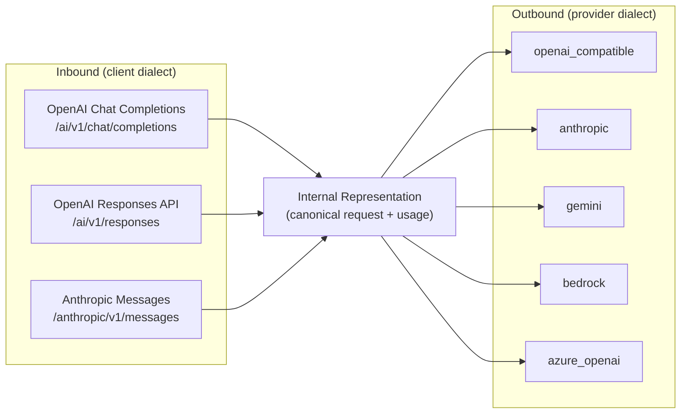

# D02 · Protocol Adapters

> [中文版](../zh-CN/design/02-protocol-adapters.md) · Part of the [ai-gateway documentation suite](../README.md)

| | |
| --- | --- |
| **Phase** | P2 (P3 for Batch/Files APIs) |
| **Depends on** | [D01 Routing](01-routing-and-lb.md) (routing selects the provider; the adapter speaks its dialect) |
| **Depended on by** | [D03 Billing](03-billing-and-monetization.md) and audit (both consume normalized usage), [D07 Caching](07-caching-strategies.md) |

## Context

Today every provider is assumed OpenAI-compatible: `AIProvider.ProviderType` defaults to `openai_compatible` and nothing branches on it except path rewriting (`rewriteOpenAIPathForProvider()` handles the DashScope rerank path). This means:

- Anthropic, Gemini, and Bedrock models are only reachable through third-party compatibility shims — provider choice is constrained by dialect, not quality or price.
- Clients built on the Anthropic SDK (increasingly common: Claude Code, MCP tooling) cannot use the gateway at all.
- Usage accounting silently assumes OpenAI's `usage` shape; cached-token and reasoning-token fields from other dialects would be dropped, corrupting billing.

The adapter layer removes dialect as a constraint in both directions, which is the prerequisite for the P2 exit criterion: *a Claude-SDK client and an OpenAI-SDK client both call the same virtual key and land on the same Gemini provider with correct usage*.

## The protocol matrix

Two independent axes. The gateway's internal representation (IR) sits in the middle, so the work is `N + M` translators, not `N × M`.



Rollout order (by demand): outbound `anthropic` → `gemini` → `azure_openai` → `bedrock`; inbound `anthropic messages` → `responses`. `openai_compatible` remains the identity adapter and the default, preserving today's behavior exactly.

### Fast path guarantee

When inbound dialect == outbound dialect (OpenAI→openai_compatible — the overwhelming majority of traffic), the adapter layer must **not** round-trip through the IR. The identity adapter passes bodies through with only the existing targeted mutations (`replaceModelInBody()`, `injectStreamUsageOption()`, `injectPromptCacheKey()`, `injectModelExtraParams()`). Full parse/serialize is paid only when translation is actually needed. This protects the hot-path budget (design principle 5).

## Internal representation

Not a lossless union of every API — a **routing-and-accounting** canonical form plus a passthrough extension bag:

```go
// internal/biz/protocol/ir.go
type ChatRequest struct {
    Model       string
    Messages    []Message      // role, content parts (text/image/audio/tool_call/tool_result)
    System      string         // Anthropic separates it; OpenAI embeds it — IR separates it
    Tools       []Tool
    Stream      bool
    MaxTokens   *int
    Temperature *float64
    // ... other first-class common params
    Extensions  map[string]json.RawMessage // dialect-specific params, forwarded when outbound dialect understands them, dropped (and audit-noted) otherwise
}

type Usage struct {
    InputTokens        int
    OutputTokens       int
    CacheReadTokens    int // OpenAI: prompt_tokens_details.cached_tokens · Anthropic: cache_read_input_tokens
    CacheWriteTokens   int // Anthropic: cache_creation_input_tokens · absent elsewhere
    ReasoningTokens    int // OpenAI: completion_tokens_details.reasoning_tokens · Gemini: thoughtsTokenCount
    Raw                json.RawMessage // provider-native usage object, preserved in audit for provenance
}
```

`Usage` is the single shape consumed by `writeAuditLog()`, `QuotaManager.CommitTokens()`, and `calcCredits()` (`internal/biz/credits.go` already prices cache-read tokens separately — the IR finally feeds that field from non-OpenAI dialects too).

## Adapter interfaces

```go
// internal/biz/protocol/adapter.go

// OutboundAdapter speaks one provider dialect. Selected by AIProvider.ProviderType.
type OutboundAdapter interface {
    // BuildRequest maps IR → provider HTTP request (URL from BaseURL + dialect path, auth header style, body).
    BuildRequest(ctx context.Context, p *model.AIProvider, req *ChatRequest) (*http.Request, error)
    // ParseResponse maps a non-streaming provider response → IR response + normalized Usage.
    ParseResponse(resp *http.Response) (*ChatResponse, *Usage, error)
    // StreamDecoder wraps the provider's SSE/chunk stream into a stream of IR events.
    StreamDecoder(body io.Reader) StreamDecoder
}

// InboundCodec speaks one client-facing dialect. Selected by route.
type InboundCodec interface {
    DecodeRequest(r *http.Request) (*ChatRequest, error)
    EncodeResponse(w http.ResponseWriter, resp *ChatResponse) error
    // StreamEncoder writes IR stream events in the client's expected wire format,
    // including dialect-correct event names, role deltas, and terminators ([DONE] vs message_stop).
    StreamEncoder(w http.ResponseWriter) StreamEncoder
}
```

Registration is compile-time (a `map[string]OutboundAdapter` populated in an `init()`-free registry wired through Wire), matching the project's "no runtime magic" stance; community adapters arrive as PRs adding one package + one registry line. `rewriteOpenAIPathForProvider()` folds into the `openai_compatible` adapter's `BuildRequest` and is deleted as a standalone.

### Streaming translation

The hard 20%. Design rules:

1. **Event-level, not token-level, state.** The translator keeps a small state machine per stream (current tool-call index, content block index) — Anthropic's `content_block_start/delta/stop` maps to OpenAI's indexed `tool_calls` deltas and vice versa.
2. **Usage arrives at different points** (OpenAI: final chunk with `stream_options.include_usage`; Anthropic: `message_delta`; Gemini: `usageMetadata` on chunks). The decoder emits a terminal `UsageEvent` regardless of source; audit/billing consume only that.
3. **First-chunk commit rule** from [D01](01-routing-and-lb.md) applies unchanged: once the encoder writes byte one, failover is off.
4. Per-chunk overhead budget: < 5 ms p99 (P2 exit criterion) — translators must not buffer whole responses; they operate chunk-in/events-out.

### Auth & endpoint dialects

| ProviderType | Auth | Path shape | Notes |
| --- | --- | --- | --- |
| `openai_compatible` | `Authorization: Bearer` | `/v1/chat/completions` | today's behavior |
| `anthropic` | `x-api-key` + `anthropic-version` | `/v1/messages` | version header configurable per provider |
| `gemini` | `x-goog-api-key` (or OAuth) | `/v1beta/models/{model}:generateContent` / `:streamGenerateContent` | model is in the *path* — `BuildRequest` owns URL construction |
| `azure_openai` | `api-key` header | `/openai/deployments/{deployment}/chat/completions?api-version=…` | deployment name ≠ model name: stored in `AIModelItem` extra params |
| `bedrock` | SigV4 signing | `/model/{modelId}/invoke(-with-response-stream)` | needs AWS credentials in provider config; the streaming wire format (event-stream) has its own decoder |

Provider-specific settings (anthropic-version, api-version, region, deployment map) live in a new nullable JSON column `adapter_config` on `ai_providers`.

## Inbound entrances

New routes registered in `internal/server/http.go`, guarded by the same `virtual_key_auth` middleware:

- `POST /anthropic/v1/messages` — Anthropic Messages codec. Accepts `x-api-key: sk-vk-*` (Anthropic SDK convention) in addition to Bearer.
- `POST /ai/v1/responses` — OpenAI Responses API codec, mapped onto the IR (stateless subset first; `previous_response_id` chaining is out of scope until demand is proven — noted as an open question).

Model resolution, quotas, routing, audit, and billing are dialect-independent because they run on the IR after decode.

## Data model changes

| Table | Change |
| --- | --- |
| `ai_providers` | `adapter_config json` (nullable) |
| `ai_model_items` | usage of existing extra-params for azure deployment mapping (no schema change) |
| `ai_gateway_audit_logs` | `inbound_protocol varchar(32)`, `cache_write_tokens int`, `reasoning_tokens int` (cache-read already exists in the billing path) |

## Touched code

| Location | Change |
| --- | --- |
| `internal/biz/protocol/` (new package) | IR, adapter/codec interfaces, registry, per-dialect implementations |
| `internal/biz/gateway.go` `ProxyRequest` | Decode via inbound codec → IR pipeline → outbound adapter; fast path preserved |
| `internal/biz/gateway.go` body-mutation helpers | Absorbed into the identity adapter |
| `internal/server/http.go` | New inbound routes |
| `internal/biz/credits.go` `calcCredits` | Accept `Usage` (adds cache-write pricing, already priced in `AIModelItem.CacheWritePricePerMillion`) |

## Testing & verification

- Golden-file tests per adapter: recorded provider fixtures (request/response/stream transcripts) → assert exact IR and exact re-encoded output. Fixtures are the contract; provider API drift shows up as fixture diffs.
- Cross-dialect matrix test: every inbound codec × every outbound adapter over a canonical conversation (text + tool call + streaming), asserting normalized `Usage` equality.
- Load test on the fast path proving zero added allocation/latency for OpenAI→openai_compatible relative to the pre-adapter baseline.
