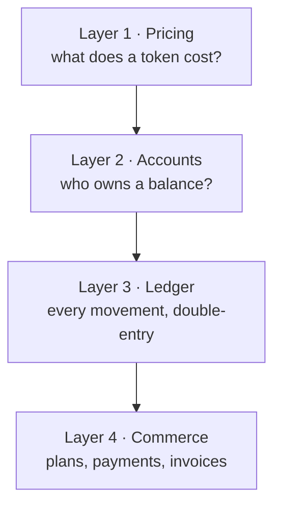
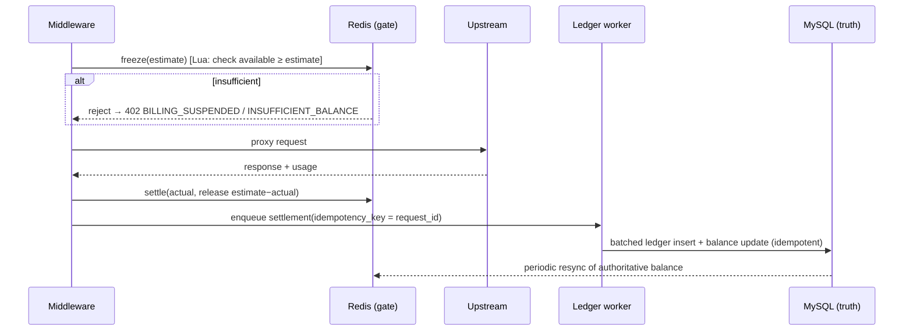

# D03 · Billing & Monetization

> [中文版](../zh-CN/design/03-billing-and-monetization.md) · Part of the [ai-gateway documentation suite](../README.md)

| | |
| --- | --- |
| **Phase** | P1 (pricing, accounts, ledger, deduction, budgets) · P2 (plans, payments, invoices) |
| **Depends on** | [D04 Multi-Tenancy](04-multi-tenancy-and-auth.md) (accounts attach to tenants), [D02 Protocol Adapters](02-protocol-adapters.md) (normalized usage), audit provenance |
| **Depended on by** | [D08 Web Console](08-web-console.md) billing center |

## Context

`internal/biz/credits.go` today computes cost: model prices from `AIModelItem` (per-million input/output/cache-read/cache-write), a CNY-per-credit rate from `ai_credits_rates`, and `calcCredits()` producing `(credits, microCredits, costCNY)`. Points are then *rate-limited* by `QuotaManager` — but nothing is ever **owned, deducted, or settled**. There is no balance, no transaction record, no suspension, no way to charge anyone. The currency is hardcoded (`getCNYRatePerCredit`, key `ai:gw:credits:rate:CNY`).

The vision commits to the full reseller loop ([archetype 2](../01-product-vision.md)): recharge → consume → suspend at zero → invoice. This document designs it in four layers, so deployments adopt only the depth they need — a platform team may stop at layer 2 (showback), a reseller uses all four.



## Layer 1 · Pricing

### Goals

Decouple **cost** (what upstream charges the operator) from **price** (what the operator charges the tenant); support any currency; support differentiated pricing per customer group.

### Design

- `AIModelItem` per-million prices are redefined as **cost** (upstream). Unchanged schema; this is what `least_cost` routing ([D01](01-routing-and-lb.md)) and margin reports read.
- New `ai_price_tables`: named sets of sell-side prices. A tenant references one price table; absent → the default table; a model absent from the table → falls back to cost (margin 0), configurable to *deny* instead for strict resellers.
- `ai_credits_rates` generalizes to any currency (it already has a `currency` column); `getCNYRatePerCredit()` becomes `getRatePerCredit(currency)` with the Redis key parameterized `ai:gw:credits:rate:{currency}`. Account balances are stored in **micro-credits** (the `microCreditScale = 1_000_000` convention in `credits.go`), currency applied at presentation and payment time only — internal arithmetic stays integer and currency-free.

**`ai_price_tables`** / **`ai_price_table_items`**

| Column | Type | Notes |
| --- | --- | --- |
| `id` / `created_at` / `updated_at` / `deleted_at` | | standard GORM |
| `name` | varchar(64) uniqueIndex | |
| `currency` | varchar(8) | display + payment currency |
| `is_default` | bool | exactly one enforced in biz |

| Column (items) | Type | Notes |
| --- | --- | --- |
| `price_table_id` | uint index | |
| `model_pattern` | varchar(128) | exact or regex, same matching semantics as `matchModelMapping()` |
| `input_price_per_million` … `cache_write_price_per_million` | decimal(18,6) | sell-side, in table currency |
| `tier_config` | json nullable | optional volume tiers `[{from_tokens, price…}]` — evaluated monthly per account |

## Layer 2 · Accounts

One balance account per **tenant** (not per key — keys are credentials, tenants are customers; per-key spend limits remain the quota system's job).

**`ai_billing_accounts`**

| Column | Type | Notes |
| --- | --- | --- |
| `tenant_id` | uint uniqueIndex | from [D04](04-multi-tenancy-and-auth.md) |
| `mode` | varchar(16) | `prepaid` / `postpaid` |
| `balance_micro` | bigint | prepaid: ≥ suspension floor; postpaid: may run negative up to `credit_limit_micro` |
| `frozen_micro` | bigint | sum of active in-flight freezes |
| `credit_limit_micro` | bigint | postpaid ceiling; prepaid overdraft allowance (default 0) |
| `price_table_id` | uint nullable | null = default table |
| `low_watermark_micro` | bigint | budget-alert threshold |
| `status` | varchar(16) | `active` / `grace` / `suspended` |
| `grace_until` | datetime nullable | |
| `version` | bigint | optimistic-lock guard for reconciliation jobs |

### Suspension policy

Balance ≤ 0 (prepaid) or ≤ −credit_limit (postpaid) ⇒ account enters `grace` for a configurable window (default 24 h, 0 = immediate), then `suspended`. Suspended ⇒ middleware rejects with `402`-style kratos error `ErrBillingSuspended` (kerrors code 402, reason `BILLING_SUSPENDED`) *before* quota checks. Recharge above zero ⇒ `active` immediately. Alerts fire on `grace` entry and at the low watermark via the notification channels in [D08](08-web-console.md) settings.

## Layer 3 · Ledger and the deduction flow

### Decision (ADR): freeze → settle, mirroring the quota pattern

- **Context:** exact cost is unknown until the response completes (streaming usage arrives last); charging must never lose money to a crash between response and settlement, and must never add a blocking DB write to the hot path.
- **Options:** (a) settle-only after response (risk: unbounded concurrent overspend at zero balance); (b) synchronous DB transaction per request (violates hot-path budget); (c) Redis freeze at request start + async DB settlement, exactly the shape of `QuotaManager.CheckAndReserve()`/`CommitTokens()` and the concurrency-slot reserve/release.
- **Decision:** (c). A Lua script freezes an *estimate* (from `max_tokens` and the price table, with a floor default) against a Redis-mirrored available balance; on response, the delta between estimate and actual is released and a settlement record is queued to the ledger writer (an `AuditWorker`-style batched async worker). Redis is the real-time gate; MySQL is the source of truth, reconciled continuously.
- **Consequences:** worst-case overspend is bounded by (freeze underestimate × in-flight requests) — acceptable and tunable via the estimate floor. Crash between freeze and settle leaves an expiring freeze (TTL = proxy timeout + margin) that auto-releases; the reconciliation job replays any audit rows lacking ledger entries. Per design principle 6, if Redis billing state is unavailable the gateway **fails open** and reconciles later (configurable to fail closed for strict resellers).



### `ai_billing_ledger`

Append-only. Every row moves value exactly once; balance is always reconstructible as the sum of a tenant's entries (enforced by an invariant test — P1 exit criterion).

| Column | Type | Notes |
| --- | --- | --- |
| `id` | bigint pk | |
| `account_id` | uint index | |
| `entry_type` | varchar(16) | `recharge` / `deduct` / `refund` / `adjust` / `freeze_expire` |
| `amount_micro` | bigint | signed: credits in, debits out |
| `balance_after_micro` | bigint | running balance snapshot |
| `idempotency_key` | varchar(64) uniqueIndex | request_id for deducts; payment order no for recharges — replay-safe |
| `ref_type` / `ref_id` | varchar(16) / varchar(64) | provenance: `audit_log` / `payment_order` / `manual` — satisfies design principle 7 (every invoice line traces to audit rows) |
| `operator_id` | uint nullable | for manual adjustments |
| `remark` | varchar(256) | |
| `created_at` | datetime index | |

### Reporting

- Raw attribution queries reuse the audit table (it already carries key, provider, model, tokens, project labels).
- New `ai_usage_daily` pre-aggregation (tenant × project × key × model × day: requests, tokens by class, cost_micro, price_micro), maintained by a scheduled job inside the ledger worker. Console charts and CSV/invoice generation read only this table — audit stays unindexed-for-analytics.

## Layer 4 · Commerce (P2)

### Subscription plans

**`ai_billing_plans`**: `name`, `price_micro`, `currency`, `period` (`monthly`/`yearly`), `granted_credits_micro`, `quota_template json` (default key quotas granted with the plan), `price_table_id`, `is_enabled`.

**`ai_billing_subscriptions`**: `tenant_id`, `plan_id`, `status` (`active`/`past_due`/`canceled`), `period_start`, `period_end`, `auto_renew`. Renewal = a ledger `recharge` with `ref_type=subscription`. Unused granted credits at period end: forfeited or rolled over per plan flag.

### Payment gateway abstraction

```go
// internal/biz/payment/gateway.go
type PaymentGateway interface {
    Name() string // "stripe" / "alipay" / "wechat"
    CreateOrder(ctx context.Context, o *PaymentOrder) (payURL string, err error)
    VerifyWebhook(r *http.Request) (*WebhookEvent, error) // signature check is the gateway's job
    QueryOrder(ctx context.Context, orderNo string) (OrderStatus, error) // active reconciliation
}
```

Adapters: Stripe (Checkout + webhook), Alipay (page pay + async notify), WeChat Pay (Native QR + notify). Same compile-time registry pattern as protocol adapters ([D02](02-protocol-adapters.md)). Webhook endpoints are unauthenticated routes with per-gateway signature verification; every webhook is idempotent via `ai_payment_orders.order_no`.

**`ai_payment_orders`**: `order_no` (uniqueIndex, ULID), `account_id`, `gateway`, `amount_micro`, `currency`, `status` (`pending`/`paid`/`failed`/`expired`/`refunded`), `gateway_txn_id`, `paid_at`, `raw_notify json`. State transitions only move forward; `paid` triggers exactly one ledger recharge (idempotency key = order_no).

Reconciliation: a periodic job queries `pending` orders older than N minutes via `QueryOrder` — webhooks get lost; polling is the safety net.

### Invoices

**`ai_invoices`**: `invoice_no`, `account_id`, `period_start/end`, `amount_micro`, `currency`, `line_items json` (generated from `ai_usage_daily`), `status` (`draft`/`issued`/`void`), `pdf_ref` (object-storage pointer, optional). Tax handling is explicitly **out of scope** — invoices are commercial records; fiscal invoicing (e-fapiao, VAT) integrates via the event bus ([D09](09-extensibility.md)) to external systems.

## Touched code

| Location | Change |
| --- | --- |
| `internal/biz/billing.go` (new) | `BillingManager`: freeze/settle Lua, account state machine, suspension |
| `internal/biz/billing_worker.go` (new) | batched ledger writer + reconciliation + daily aggregation (clone of `AuditWorker` pattern) |
| `internal/biz/payment/` (new) | gateway interface + adapters (P2) |
| `internal/biz/credits.go` | generalize currency; expose price-table-aware `calcPrice()` alongside cost |
| `internal/middleware/virtual_key_auth.go` | billing gate (suspension check + freeze) after key resolution, before quota reserve |
| `internal/biz/gateway.go` `ProxyRequest` | settle call next to existing `CommitTokens` |
| `internal/biz/errors.go` | `ErrBillingSuspended`, `ErrInsufficientBalance` (kerrors 402) |
| `cmd/server/wire.go` | new providers; regenerate |

## Testing & verification

- Property test: any interleaving of freeze/settle/expire/recharge keeps `balance_after_micro` chain consistent and Redis-vs-MySQL drift within the in-flight bound.
- Idempotency: replaying every webhook and every settlement twice changes nothing (uniqueIndex asserted).
- End-to-end P1 exit flow: recharge → consume to zero → 402 → recharge → resume (see [Roadmap](../03-roadmap.md)).
- Payment adapters tested against gateway sandbox environments in CI (nightly, credential-gated), signature-verification unit tests with recorded fixtures.
