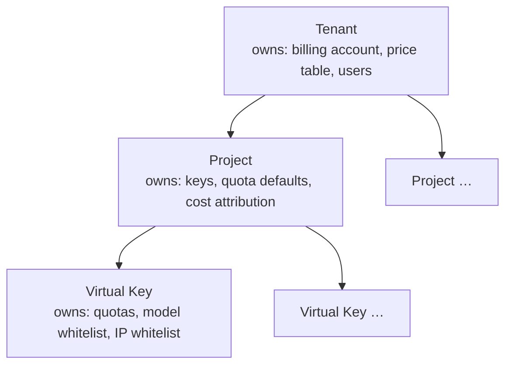

# D04 · Multi-Tenancy & Management-Plane Auth

> [中文版](../zh-CN/design/04-multi-tenancy-and-auth.md) · Part of the [ai-gateway documentation suite](../README.md)

| | |
| --- | --- |
| **Phase** | P0 (admin token) · P1 (tenants, users, RBAC) · P2 (OIDC/SSO) |
| **Depends on** | — (foundation document) |
| **Depended on by** | [D03 Billing](03-billing-and-monetization.md) (accounts per tenant), [D08 Web Console](08-web-console.md) (login, roles), all management APIs |

## Context

Two related gaps:

1. **The management plane has no authentication.** `POST /ai/gateway/key`, `GET /ai/gateway/key/reveal`, audit queries — all respond to anyone who can reach the port. The README's "assume upstream reverse proxy handles auth" is a deployment assumption, not a product. The first `docker run` by an evaluator must not expose key-reveal to the LAN.
2. **There is no tenancy.** Virtual keys are a flat namespace. `AIVirtualKey` already carries `project_id` / `project_name` / `env_id` — but as free-text label columns (`internal/data/model/virtual_key.go:40-42`), used only as list filters (`gateway.go:163`). Labels cannot own balances, inherit quotas, or bound RBAC.

Both are solved by one hierarchy and one principal model.

## The hierarchy

Three levels, fixed. A deeper arbitrary tree (departments → teams → squads…) was considered and rejected: every additional level multiplies inheritance/attribution complexity, and both target archetypes (platform team, reseller) map cleanly onto tenant→project. Organizational structure beyond that belongs in labels (the existing `env_id` stays as a free label for env-style filtering).

**Single-tenant mode is the default.** On first startup a `default` tenant and `default` project are auto-created and every existing/new key attaches to them. Deployments that never think about tenancy see no new mandatory concepts — this matters for the SaaS-team archetype and for upgrade compatibility (existing rows migrate to the default tenant additively).

### Inheritance semantics

| Setting | Resolution order |
| --- | --- |
| Quotas | key explicit → project default template → unlimited |
| Price table / billing | tenant only (accounts live at tenant level, per [D03](03-billing-and-monetization.md)) |
| Budget alerts | tenant and project both may set; both fire |
| Model whitelist | key explicit → project default → all provider models |

Enforcement point stays where it is today (middleware + `enforceModelQuota`); inheritance is resolved at key-cache load time and embedded in the cached key snapshot, so the hot path pays nothing — one more reason the L1/L2 key cache (`internal/biz/key_cache.go`) invalidation must also fire on project/tenant updates (extend the existing `ai:gw:key:invalidate` pub/sub payload with an entity type).

## Data model

**`ai_tenants`**: `id`, `name` (uniqueIndex), `display_name`, `status` (`active`/`suspended`), `settings json`, timestamps.

**`ai_projects`**: `id`, `tenant_id` (index), `name` (uniqueIndex with tenant_id), `quota_template json`, `default_model_whitelist json`, timestamps.

**`ai_virtual_keys`** (additive migration): `tenant_id uint index`, `project_ref_id uint index` (FK to `ai_projects`; the legacy free-text `project_id`/`project_name` columns are kept, backfilled from the new relation for API compatibility, and deprecated in list filters).

### Decision (ADR): row-level isolation, not schema-level

- **Context:** tenants must not see each other's keys, logs, or spend.
- **Options:** (a) `tenant_id` column + mandatory scoping; (b) schema/database per tenant; (c) separate deployments per tenant.
- **Decision:** (a). A GORM scope (`scopeTenant(tenantID)`) applied by the service layer to every management query; the proxy data path is naturally tenant-scoped because everything hangs off the resolved key.
- **Consequences:** cheapest to operate, works on SQLite/PG/MySQL alike, supports thousands of tenants. The risk — a forgotten scope leaking cross-tenant data — is mitigated by (1) putting tenant resolution in middleware so handlers never touch it manually, and (2) an integration test that exercises every list endpoint with two tenants and asserts zero cross-leakage. Deployments needing hard isolation run separate instances (option c is a deployment choice, not a product feature).

## Management-plane principals

Three principal types, arriving in phases:

| Principal | Phase | Mechanism |
| --- | --- | --- |
| **Bootstrap admin token** | P0 | `admin_token` in `configs/config.yaml` (or env var). Sent as `Authorization: Bearer` on `/ai/gateway/*`. Full access. Removes the "open admin port" hazard with one config line. |
| **Users** (console login) | P1 | `ai_users`: email, password hash (argon2id), tenant memberships. Session = signed cookie or JWT for the console. |
| **Admin API keys** | P1 | `ai_admin_keys`: hashed like virtual keys (SHA-256 lookup + AES-encrypted plaintext — reuse `internal/pkg/aes.go` and the virtual-key storage pattern), scoped to a tenant + role. For automation/CI. |
| **OIDC / SSO** | P2 | Standard OIDC code flow; JIT user provisioning mapped to a role via configurable claim rules. Password login disable-able. |

A new middleware `admin_auth.go` (parallel to `virtual_key_auth.go`) guards `/ai/gateway/*`: resolve principal → resolve tenant scope + role → inject into context via typed keys (`adminPrincipalCtxKey{}`, following the project's context-key convention). The bootstrap token maps to a synthetic super-admin principal so P0 and P1 share one code path.

## RBAC

Four roles per tenant membership — deliberately not a permission-matrix engine; roles are hardcoded sets checked by one `require(role)` helper. (A custom-permission engine is a P3+ question; every early user need maps onto these four.)

| Capability | Owner | Admin | Member | Viewer |
| --- | --- | --- | --- | --- |
| View dashboards, usage, audit *metadata* | ✅ | ✅ | ✅ | ✅ |
| View audit request/response **bodies** | ✅ | ✅ | ⚙️ per-tenant toggle | ➖ |
| Create/update keys, mappings, quotas | ✅ | ✅ | ✅ (own projects) | ➖ |
| **Reveal key plaintext** | ✅ | ✅ | ➖ | ➖ |
| Manage providers, price tables | ✅ | ✅ | ➖ | ➖ |
| Billing: recharge, plans, invoices | ✅ | ✅ | ➖ | ➖ |
| Manage members/roles, delete tenant | ✅ | ➖ | ➖ | ➖ |

Cross-tenant (instance-level) administration — providers are global objects, as are price tables and system settings — belongs to a **platform admin** flag on users (or the bootstrap token). Providers are the one deliberate sharing point: tenants consume centrally managed upstreams and never see upstream API keys.

Every state-changing management call writes an operator audit row (`ai_admin_audit_logs`: principal, action, entity, before/after digest) — separate from gateway traffic audit; this is the console's "activity log" and a compliance requirement in its own right.

## API surface changes

- All existing `/ai/gateway/*` routes gain the auth middleware (breaking by design — the P0 release note's headline migration step).
- New routes: `/ai/gateway/tenants` CRUD, `/ai/gateway/projects` CRUD, `/ai/gateway/users` + `/ai/gateway/auth/login|logout|oidc/*`, `/ai/gateway/admin-keys` CRUD — same envelope conventions, DTOs following `<Verb><Domain>Req/Resp`.
- Existing key/audit/quota list endpoints gain implicit tenant scoping + optional `projectRefId` filters.

## Touched code

| Location | Change |
| --- | --- |
| `internal/data/model/tenant.go`, `project.go`, `user.go`, `admin_key.go`, `admin_audit_log.go` (new) | models above |
| `internal/middleware/admin_auth.go` (new) | principal resolution, tenant scope, `require(role)` |
| `internal/biz/tenant.go`, `internal/biz/auth.go` (new) | use cases; `scopeTenant` GORM scope |
| `internal/biz/gateway.go` | tenant scoping on list/stats queries; inheritance resolution in key snapshot loading |
| `internal/biz/key_cache.go` | invalidation payload gains entity type (project/tenant fan-out) |
| `internal/server/http.go` | new routes; middleware wiring |
| `configs/config.yaml` + `internal/conf/conf.go` | `admin_token`, session secret, OIDC block |

## Testing & verification

- Two-tenant leakage suite: every list/read endpoint under tenant A must return zero tenant-B rows (the ADR's guard rail).
- Role matrix table test: each role × each endpoint → expected allow/deny.
- Upgrade test: a pre-tenancy database snapshot migrates to default-tenant attachment with all keys still resolving on the proxy path.
- P1 exit criterion: member can view usage but cannot reveal keys or change quotas ([Roadmap](../03-roadmap.md)).
