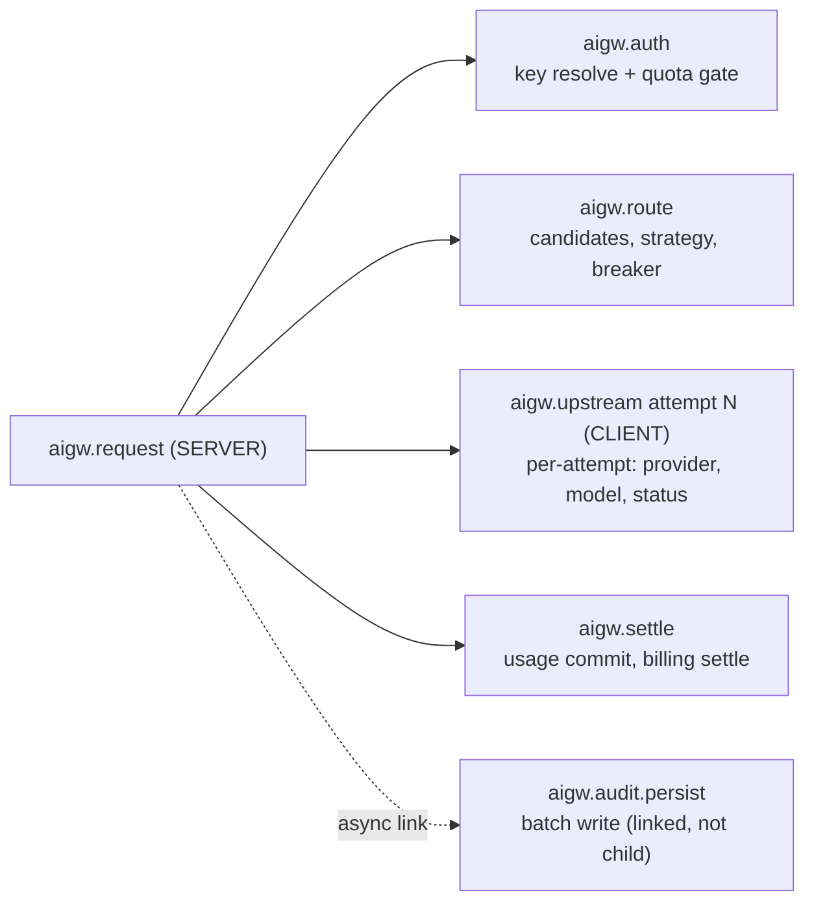

# D05 · Observability

> [中文版](../zh-CN/design/05-observability.md) · Part of the [ai-gateway documentation suite](../README.md)

| | |
| --- | --- |
| **Phase** | P0 (metrics, health endpoints, dashboards) · P2 (OTel tracing) |
| **Depends on** | — |
| **Depended on by** | [D01 Routing](01-routing-and-lb.md) (`least_latency` consumes attempt observations; breaker state is exported), [D08 Console](08-web-console.md) dashboard |

## Context

The gateway currently has structured logs (kratos `log.Helper`) and its own audit trail — and nothing else. No `/metrics`, no `/healthz`, no traces. Operators cannot answer "what's the p99 right now?", Kubernetes cannot probe readiness, and the routing designs have no latency signal to consume. Audit logs are the *business* record; they are neither queryable at metric speed nor connected to infrastructure tooling. This document adds the third leg.

Boundary rule: **audit answers "what did key X do?"; metrics answer "how is the system behaving?"; traces answer "why was this request slow?"** Data flows into each independently; none substitutes for another.

## Metrics (P0)

### Stack

`prometheus/client_golang`, exposed on a configurable **separate listener** (`server.metrics.addr`, default `:9090`) — the proxy port faces untrusted clients; metrics must not. Registered as a Kratos server alongside HTTP in `internal/server/server.go`.

### Instrument set

Prefix `aigw_`. Cardinality rule up front: labels may include `provider`, `model`, `tenant`, and coarse `status_class` — **never** `virtual_key`, `request_id`, or raw status codes. Per-key detail is the audit system's job; a 10k-key deployment must not create 10k series per instrument. (`tenant` is bounded by the business; a per-tenant series budget is documented and an opt-out flag exists for very large resellers.)

| Instrument | Type | Labels | Notes |
| --- | --- | --- | --- |
| `aigw_requests_total` | counter | route, inbound_protocol, status_class, tenant | all proxy traffic |
| `aigw_request_duration_seconds` | histogram | provider, model, stream | end-to-end proxy latency |
| `aigw_ttft_seconds` | histogram | provider, model | first upstream byte; streaming only |
| `aigw_upstream_attempts_total` | counter | provider, model, outcome | outcome: success / retryable_error / fatal_error — feeds [D01](01-routing-and-lb.md) verification |
| `aigw_failover_total` | counter | from_provider, to_provider | |
| `aigw_breaker_state` | gauge | provider | 0 closed / 1 half-open / 2 open |
| `aigw_tokens_total` | counter | provider, model, token_class, tenant | token_class: input / output / cache_read / cache_write / reasoning |
| `aigw_cost_micro_total` | counter | provider, model, tenant | upstream cost, micro-credits |
| `aigw_quota_rejections_total` | counter | dimension, tenant | dimension = existing `QuotaDim*` constants |
| `aigw_billing_rejections_total` | counter | reason, tenant | suspended / insufficient_balance |
| `aigw_concurrency_slots` | gauge | tenant | in-use slots (from the existing ZSET) |
| `aigw_cache_requests_total` | counter | cache_type, outcome | [D07](07-caching-strategies.md): exact/semantic × hit/miss/bypass |
| `aigw_guardrail_actions_total` | counter | policy, action | [D06](06-security-and-guardrails.md) |
| `aigw_audit_queue_depth` / `aigw_audit_spill_total` | gauge / counter | — | health of the async pipeline — the silent failure mode today |
| `aigw_key_cache_hits_total` | counter | level (l1/l2/db) | validates the cache design under load |

Instrumentation points map onto existing seams: middleware entry/exit (`virtual_key_auth.go`), the attempt loop in `ProxyRequest`, `QuotaManager` rejection paths, `AuditWorker` queue operations — no new abstraction, just counters at the joints. `RouterManager.ReportResult` ([D01](01-routing-and-lb.md)) writes both the Prometheus histogram and the Redis EWMA in one call so the two latency views cannot diverge.

## Health endpoints (P0)

On the **main** listener (LBs and k8s probe what they route to):

- `GET /healthz` — liveness: process up, event loop responsive. No dependency checks (a Redis blip must not get pods killed).
- `GET /readyz` — readiness: MySQL ping + Redis ping, each with a 1 s timeout, cached for 2 s. Failure ⇒ 503 with a JSON body naming the failing dependency. During graceful shutdown, `readyz` flips to 503 first, then Kratos drains (its stop sequence already handles server drain; the audit/billing workers' queues flush on stop — worth an explicit drain-timeout config).

Both endpoints bypass auth middleware and are excluded from audit and metrics-request counting.

## Grafana dashboards (P0)

Shipped in-repo under `deploy/grafana/` as JSON, provisioned automatically by the docker-compose stack ([D10](10-deployment-and-ops.md)):

1. **Gateway overview** — RPS, error rate, p50/p95/p99, TTFT, in-flight concurrency, audit queue depth.
2. **Providers** — per-provider latency/attempts/failovers, breaker-state timeline, token throughput.
3. **Economics** — tokens and cost by tenant/model, quota/billing rejections, cache hit-rate savings.

Alert rules (Prometheus format, same directory): breaker open > 5 min, audit spill growing, readyz flapping, p99 above SLO, billing rejections spike.

## OpenTelemetry tracing (P2)

### Design

- SDK: `go.opentelemetry.io/otel` with OTLP exporter; config block `observability.otlp_endpoint` (empty = tracing disabled entirely — zero overhead when off, honoring the single-binary-minimal-deps principle).
- **Context propagation:** incoming W3C `traceparent` is honored (clients get end-to-end traces through the gateway); the gateway's trace context propagates to upstream providers via `traceparent` — harmless where ignored. The existing request ID (`internal/biz/request_id.go`) is attached as a span attribute and stays the audit correlation key; audit rows gain a `trace_id` column so the console can deep-link log ⇄ trace.
- Sampling: parent-based + configurable ratio (default 1%), with a force-sample header for debugging, gated to authenticated admin principals.

### Span topology

Span attributes follow OTel GenAI semantic conventions where they exist (`gen_ai.system`, `gen_ai.request.model`, `gen_ai.usage.input_tokens`, …) so traces are legible to any GenAI-aware backend; prompt/completion *content* is never attached to spans (that is audit's job, with its access controls).

## Logging alignment (P0, small)

- Add `trace_id`/`request_id` to the kratos logger's `With` context so structured logs correlate with traces and audit.
- Document log levels already conventional in the codebase (CLAUDE.md); add a `log.level` config knob (currently absent).

## Touched code

| Location | Change |
| --- | --- |
| `internal/observability/` (new) | metric registry + instrument definitions, otel setup, readiness checker |
| `internal/server/http.go` / `server.go` | metrics listener, healthz/readyz routes, middleware instrumentation |
| `internal/middleware/virtual_key_auth.go` | request counter/histogram hooks |
| `internal/biz/gateway.go`, `quota.go`, `audit.go`, `router.go` | counters at the seams listed above |
| `internal/conf/conf.go` + `configs/config.yaml` | `observability` block (metrics addr, otlp endpoint, sample ratio, log level) |
| `deploy/grafana/`, `deploy/prometheus/` (new) | dashboards, alert rules, scrape config |
| `cmd/server/wire.go` | provide the observability component; regenerate |

## Testing & verification

- Unit: cardinality guard — a test walks registered instruments and fails if any label set includes forbidden keys.
- Integration: scrape `/metrics` during the D01 failover test and assert `aigw_failover_total` increments and `aigw_breaker_state` transitions are visible.
- `readyz` flips to 503 when Redis is stopped, back to 200 on recovery, within the cache window.
- P2: golden trace test — one streamed request produces the span topology above with GenAI attributes populated.
