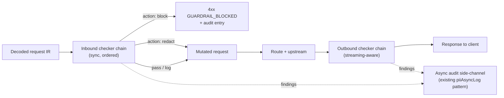

# D06 · Security & Guardrails

> [中文版](../zh-CN/design/06-security-and-guardrails.md) · Part of the [ai-gateway documentation suite](../README.md)

| | |
| --- | --- |
| **Phase** | P0 (provider key encryption) · P1 (built-in PII engine) · P2 (guardrail pipeline, external engines) |
| **Depends on** | [D09 Extensibility](09-extensibility.md) shares the checker/hook shape (guardrails are the first internal consumer) |
| **Depended on by** | [D08 Console](08-web-console.md) security overview |

## Context

What exists: a PII policy *framework* — `applyPIIPolicy()` (`internal/biz/pii.go:38`) is wired into the proxy path with three defined actions (`PIIActionBlock` / `PIIActionRedact` / `PIIActionLog`), an async audit side-channel (`piiAsyncLogKey`, consumed in `writeAuditLog` with a 200 ms wait), and a policy model (`internal/data/model/pii_policy.go`). What's missing: it detects nothing — the stub always passes traffic through.

Also in scope, because it is the most acute security defect found in the gap analysis: `AIProvider.APIKey` is a **plaintext varchar** (`internal/data/model/provider.go:25`) while virtual keys get AES-256-GCM. A database dump today leaks every upstream credential.

## P0 · Secrets hardening

### Provider API key encryption

Reuse `internal/pkg/aes.go` exactly as virtual keys do: store `api_key_encrypted`, decrypt at provider load. Migration: a one-time startup pass encrypts any legacy plaintext rows (detectable by prefix/format), then the plaintext column is emptied. Decrypted keys live only in the provider snapshot cache, never in logs or API responses (the model already tags `json:"-"`).

### Encryption key lifecycle

The single 32-byte `system.encryption_key` gains: (a) support for supplying via env var / file path (compose and k8s secrets need this — see [D10](10-deployment-and-ops.md)); (b) a documented **re-key procedure**: `server rekey -old KEY -new KEY` CLI subcommand re-encrypting virtual keys, provider keys, and admin keys in one transaction. Key *versioning* (multiple live keys) is deliberately deferred — re-key downtime is seconds at realistic row counts.

### Audit body encryption (P1, opt-in)

Prompt/response bodies (`audit_log_bodies` table) are the most sensitive data at rest. Opt-in flag `audit.encrypt_bodies`: AES-GCM per row with the system key. Trade-off documented: encrypted bodies are excluded from ES full-text indexing — deployments choose searchability or at-rest encryption per their compliance posture. (ES-side encryption remains the deployment's responsibility either way.)

## The guardrail pipeline

One pipeline generalizes PII, prompt-injection, topic fencing, and future checks, replacing the idea of N parallel bespoke hooks:



```go
// internal/biz/guardrail/checker.go
type Checker interface {
    Name() string
    // Check inspects (and may rewrite) content. Direction: inbound|outbound.
    Check(ctx context.Context, c *Content, dir Direction) (Finding, error)
}
// Finding: action (none|log|redact|block), types ([]string, e.g. "id_card","injection"), details for audit.
```

- **Chain config** is per-policy: an ordered list of checker names with per-checker settings, stored in the existing `AIPIIPolicy` model generalized to `ai_guardrail_policies` (additive rename-by-view: keep the table, add `checker_chain json`). Policies bind to tenant/project/key, most specific wins.
- **Sync vs async:** checkers declare a mode. `block`-capable checkers run sync (bounded by a per-chain deadline, default 100 ms — over deadline ⇒ configurable fail-open/fail-closed per policy, default fail-open with a `log` finding). Log-only checkers run async on the existing side-channel and never touch latency.
- **Streaming outbound:** checkers see a sliding window of decoded text (from the [D02](02-protocol-adapters.md) stream events), can only act `log` or **terminate** (inject a dialect-correct error event and close) — mid-stream redaction of already-sent bytes is impossible by definition.
- Failure containment: a checker `error` (as opposed to a finding) is logged, counted (`aigw_guardrail_actions_total{action="error"}`), and treated per the policy's fail-open/closed flag — one broken regex must not take down the proxy.

## Built-in checkers

### P1 · `pii_rules` — rule-based PII, zero dependencies

Works out of the box, offline, in both English and Chinese contexts:

- Detectors: regex + checksum validation where available (CN resident ID incl. checksum digit, CN mobile, bank card via Luhn, email, IPv4/6, passport formats, generic API-key/secret patterns) plus a configurable custom-pattern list per policy.
- Redaction: type-preserving masks (`110***********1234`) so downstream models retain context shape.
- Detection targets message *text parts* of the IR — not raw JSON — so keys/structure are never corrupted by redaction (this is why the pipeline consumes the [D02](02-protocol-adapters.md) IR rather than bodies).

Explicitly framed as *rule-grade*: strong on structured identifiers, blind to free-text PII (names, addresses). That honesty pushes serious compliance users to:

### P2 · `external` — remote engine adapter

One checker that calls an external detection service (gRPC preferred, HTTP fallback) with the content window and returns findings — integrates Microsoft Presidio, cloud DLP APIs, or in-house engines. Timeout/fail-policy per the chain rules; results cacheable by content hash for repeated prompts.

### P2 · `prompt_injection` and `topic_fence`

- `prompt_injection`: layered — heuristic signature list (known jailbreak/system-prompt-exfiltration patterns) at zero cost, optional LLM-judge mode routing the *suspicion window* to a configured cheap model **through the gateway itself** (a provider + virtual key designated in settings — dogfooding, fully audited, and reuses routing/billing).
- `topic_fence`: allow/deny topic lists via embedding similarity against configured exemplar phrases (shares the embedding infrastructure with [D07 semantic cache](07-caching-strategies.md)); LLM-judge optional, same mechanism as above.

Both ship conservative-off: enabling a checker is a policy decision, never a default surprise.

## Data model changes

| Table | Change |
| --- | --- |
| `ai_providers` | `api_key` → encrypted-at-rest (same column, encrypted content + startup migration) |
| `ai_pii_policies` → generalized | add `checker_chain json`, `fail_mode varchar(8)`, `scope_tenant_id/project_id/key_id` |
| `ai_gateway_audit_logs` | existing `pii_action`/`pii_types` generalize to guardrail findings (`guardrail_findings json` additive; legacy columns kept in sync) |

## Touched code

| Location | Change |
| --- | --- |
| `internal/pkg/aes.go` | unchanged; reused for provider keys + rekey CLI |
| `cmd/server/main.go` | `rekey` subcommand |
| `internal/biz/guardrail/` (new) | pipeline, checker registry, built-in checkers |
| `internal/biz/pii.go` | `applyPIIPolicy` becomes the pipeline entry; async side-channel and action constants retained |
| `internal/biz/gateway.go` | outbound chain hook in the response/stream path |
| `internal/biz/errors.go` | `ErrGuardrailBlocked` (kerrors 400, reason `GUARDRAIL_BLOCKED`, metadata: checker, types) |

## Testing & verification

- Corpus tests per detector: labeled positive/negative sets (incl. checksum edge cases — a valid-format-invalid-checksum ID must not match); precision regressions fail CI.
- Redaction round-trip: redacted IR re-encodes to valid provider JSON for every outbound dialect.
- Chain semantics: deadline-exceeded honors fail-mode; checker panic is contained; block short-circuits later checkers.
- Streaming: injected termination event is dialect-correct for each inbound codec.
- Security review gate ([Roadmap](../03-roadmap.md) P0-4): DB dump contains no plaintext upstream credentials.

## Implementation notes (ADR addendum)

What actually shipped for the P2 guardrail pipeline, and where it diverges from the design above:

- **Package split to avoid an import cycle.** `internal/biz/guardrail/` (`checker.go`, `chain.go`, `external.go`) has zero dependency on `biz` — `Checker`, `Chain`, and the gRPC `external` checker live there untouched. The `pii_rules` checker (which needs the existing `scanPII`/`piiDetectors`) is instead a thin adapter in `internal/biz/pii_rules_checker.go`, inside package `biz`, wrapping `guardrail.Checker`. `biz` depends on `guardrail`, never the reverse. `prompt_injection` and `topic_fence` as standalone checkers were not built — the existing injection heuristic is still reachable only via `pii_rules`' `injection` flag, unchanged from before this pipeline existed.
- **External checker contract** is a real protobuf/gRPC service (`api/guardrail/v1/guardrail.proto`, `GuardrailEngine.Check`), not HTTP-fallback — one transport, kept simple. `internal/biz/guardrail/external.go` wraps it as a `Checker` with a per-call timeout; content-hash caching of external results was not built (each call goes over the wire — acceptable at the P2 stage, revisit if a real deployment shows external-engine latency dominating).
- **Strictly additive, dual-path activation.** `ai_pii_policies` gained `checker_chain json` and `fail_mode varchar(8)` (default `'open'`) exactly as the data-model table describes, but the table was **not** renamed to `ai_guardrail_policies` — renaming a live table wasn't worth the migration risk for what is still, functionally, the PII policy table. `applyPIIPolicy` (`internal/biz/pii.go`) first tries `buildChainForPolicy(policy, tenantName)`; if the policy has no `checker_chain` configured, it falls through to the exact original single-engine `scanPII` path, byte-for-byte. No existing deployment changes behavior by upgrading; the chain only activates once an operator opts a policy into it.
- **Outbound scanning ships for non-streaming responses only.** `applyOutboundGuardrail` (`internal/biz/pii.go`) runs the same chain against the assistant's text (extracted from the decoded JSON body) for both the identity and translated-dialect (anthropic/gemini) non-streaming paths, and can redact or block before `gateway.go`'s `ProxyRequest` writes the response header/body — the non-streaming path was restructured (`WriteHeader` moved to after the guardrail check, `Content-Length` stripped since redaction changes body length) specifically to make this possible without breaking the "no rewrite once bytes are sent" streaming-commit rule.
- **Streaming outbound scanning was not built.** The design's "streaming-aware" outbound chain (sliding window over decoded SSE deltas, `log`/`terminate` only) is deferred — `streamProxy`/`translateAnthropicStream`/`translateGeminiStream` would all need restructuring to decode-scan-reencode each chunk, and that was judged too large a change to bundle with the rest of this pipeline. Today, streaming responses bypass outbound guardrails entirely, exactly as they did before this pipeline existed. This is the one place implementation is genuinely behind the design, not just differently shaped.
- **Audit body encryption (P1 item, built alongside P2)**: `audit.encrypt_bodies` (config), AES-GCM via the existing `system.encryption_key` and `internal/pkg/aes.go`, applied in `AuditWorker.encryptBody` before body rows are persisted; when enabled, the ES-bound copy is left blank rather than storing ciphertext (per the documented searchability/encryption trade-off). `gateway.go`'s `decryptAuditBody` best-effort-decrypts on read and falls back to the raw stored value, so historical plaintext rows remain readable if encryption is turned on later — no backfill migration needed or built.
- **Findings surfaced to audit** reuse the existing `pii_action`/`pii_types` columns (populated from the chain's most-severe action and the union of all findings' types) rather than adding a new `guardrail_findings json` column — the existing columns already capture what's needed for the console's Security tab, and a redundant JSON blob felt like premature schema growth.

### Round 2: standalone `prompt_injection`/`topic_fence`, streaming outbound scanning

Closes the two items round 1 explicitly called out as gaps.

- **`prompt_injection` and `topic_fence` are now standalone checkers** (`internal/biz/prompt_injection_checker.go`, `internal/biz/topic_fence_checker.go`), usable in a `checker_chain` on their own without needing `pii_rules` too — the legacy `pii_rules.injection` flag is untouched and still works exactly as before (both paths reuse the same `promptInjectionSignatures` list from `pii_engine.go`, so there's exactly one signature list to maintain, not two). **Scope simplification from the design above**: `topic_fence` is a curated substring blocklist (`blockedTopics []string`, case-insensitive), not embedding-similarity against exemplar phrases — reusing D07's embedding infrastructure for this was judged a bigger lift than the rest of this round, and a keyword fence is still a real, useful guardrail (same "rule-grade, not semantic-grade" honesty the design already applies to `pii_rules`). Neither checker got the optional LLM-judge escalation mode the design sketched — both stay the zero-cost heuristic layer only, same scope as the legacy flag before them. Both apply the chain-wide `policy.Action` uniformly (like `pii_rules_checker`'s `fixedAction`) rather than introducing a per-checker action override.
- **Streaming outbound scanning now ships**, via a wrapper rather than the restructuring the design (and round 1's ADR note) assumed was necessary. `internal/biz/guardrail_stream.go`'s `guardrailStreamWriter` wraps the real `http.ResponseWriter` — the same wrapper-around-`http.ResponseWriter` shape `anthropicResponseWriter`/`responsesResponseWriter` already use elsewhere in this codebase — and re-scans the accumulated visible assistant text (parsed back out of each SSE `data: {...}` line as it's written, capped at 64 KiB to bound rescan cost) on every chunk. `streamProxy`/`translateAnthropicStream`/`translateGeminiStream`/`translateBedrockStream` (and its four Titan/Llama/Mistral/Nova family translators) are **all untouched** — `gateway.go`'s two streaming call sites just wrap `w` before handing it to whichever translator, and unwrap the verdict after. This is the "sliding window... log/terminate only" mode the design called for: a block/redact-worthy finding terminates the stream (further chunks are silently swallowed — no more bytes reach the client) since already-sent bytes can never be rewritten (the streaming-commit rule); a log-only finding just records via the same `piiAuditCtxKey` side-channel the non-streaming path already populates, so `writeAuditLog` needed zero changes. One documented gap: terminating stops *sending* further bytes but doesn't cut the upstream read short — the read loop still runs to natural completion, a minor inefficiency rather than a security gap (the safety property is "no more violating content reaches the client," which holds regardless).

> **Operator note — streaming guardrails are best-effort, not a hard block.** `gateway.go` writes `WriteHeader(200)` and starts flushing SSE chunks to the client *before* `guardrailStreamWriter` has re-scanned enough accumulated text to raise a finding — this is required by the streaming-commit rule (`backend/CLAUDE.md`: "once any byte reaches the client, no failover, no retry, no rewrite") and cannot be fixed without buffering the whole response, which would defeat the purpose of streaming. Practically: a block/terminate-worthy finding still stops the *rest* of the response from reaching the client, but whatever text was already flushed in earlier chunks — potentially including the very content that triggered the finding — has already left the gateway. Non-streaming requests do not have this gap (`applyOutboundGuardrail` runs to completion before anything is written). Deployments with a hard compliance requirement that a blocked response never partially reach the client should disable streaming for policies where that matters, or treat the streaming chain as a detection/audit safety net layered on top of a stricter inbound policy rather than the sole line of defense.

### Round 3: `AIPIIPolicy` admin CRUD + console checker-chain builder

Closes the "console UI" gap the [Web Console design](08-web-console.md) already anticipated (its endpoint table lists a `guardrail-policies` route) but that had no backing API until now — `resolvePIIPolicy`/`buildChainForPolicy` could only ever read a policy a human inserted directly into the database.

- **Route is `/ai/gateway/pii-policies`, not `/ai/gateway/guardrail-policies`.** The table remains `ai_pii_policies` (round 1's ADR already decided not to rename it), so the admin route name follows the table/resource, not the pipeline's newer marketing name — consistent with this codebase's convention of naming CRUD routes after the underlying resource (`/model-items`, `/price-tables`, …), not the feature story. The console page is still titled/labeled "Guardrail Policies" (`GuardrailPolicies.tsx`, i18n keys `guardrailPolicies`/`navManage`) since that's the operator-facing concept; only the URL differs from the design doc's illustration.
- **`internal/biz/pii_policy_admin.go`** (mirrors `mcp_admin.go`'s shape): Create/List/Update/Delete, global-object posture (platform-admin only), same as every other admin resource in this codebase. Two behaviors not present in a generic CRUD template: `ListPIIPolicies` populates the previously-defined-but-always-zero `BoundKeyCount` field via a `COUNT(*) ... GROUP BY pii_policy_id` on `ai_virtual_keys`, and Create/Update enforce **at most one `isDefault=true` policy** inside a DB transaction (unsetting every other row's flag first) — `resolvePIIPolicy`'s fallback-to-default query has always assumed exactly one default exists; nothing previously stopped an operator from creating two, which would have made "which policy is actually default" depend on undefined query ordering.
- **Console checker-chain builder is add/remove, not drag-sortable** — a deliberate asymmetry with the Model Mappings fallback-chain editor ([D01](01-routing-and-lb.md)). A fallback chain's *order* is the entire point (first candidate tried first); a checker chain's order matters far less (each checker independently flags/blocks/redacts against the chain-wide `policy.Action`), so paying for `@dnd-kit` wiring on this second list wasn't judged worth it — append-to-end plus a remove button is enough. Each checker kind gets its own settings card: `pii_rules` renders a detector checkbox grid (`cn_id_card`/`cn_mobile`/`bank_card`/`email`/`ipv4`/`api_secret`, matching `pii_engine.go`'s detector list exactly) plus the legacy `promptInjection` flag checkbox; `prompt_injection` and `topic_fence` (a comma-separated blocked-topics input) and `external` (target address + timeout-ms) each render their own settings shape, matching `guardrail_pipeline.go`'s `checkerConfig`/`*Settings` structs field-for-field so the console never drifts from what the backend actually parses.
