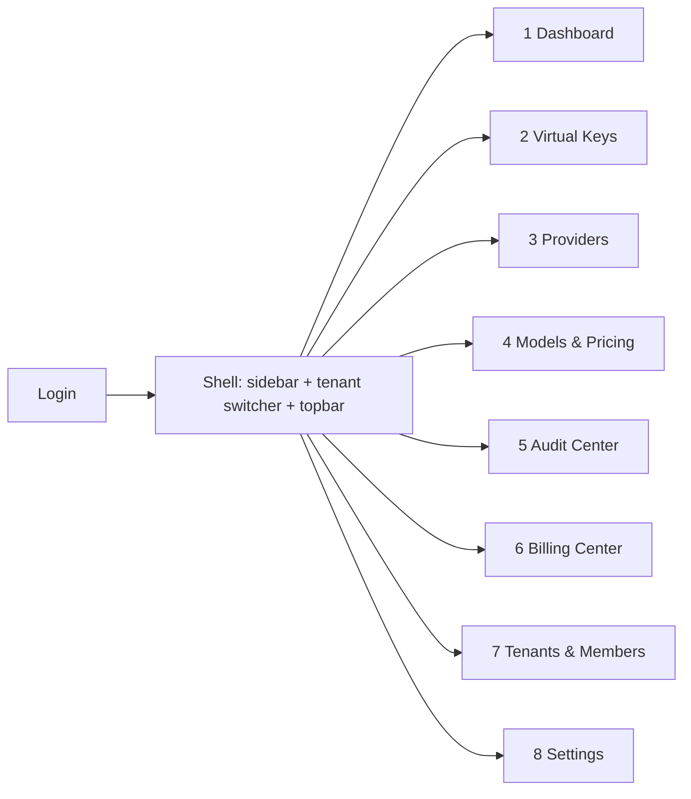

# D08 · Web Console

> [中文版](../zh-CN/design/08-web-console.md) · Part of the [ai-gateway documentation suite](../README.md)

| | |
| --- | --- |
| **Phase** | P1 (MVP: modules 1–3, 5 + login) · P2 (modules 4, 6, 7, 8) |
| **Depends on** | [D04 Auth/RBAC](04-multi-tenancy-and-auth.md) (login, roles), [D03 Billing](03-billing-and-monetization.md), [D05 Observability](05-observability.md), [D01 Routing](01-routing-and-lb.md) |
| **Depended on by** | — (pure client of the public API, by design principle 4: *headless first*) |

## Context

The gateway is API-only. Evaluators judge an infra project by its console before reading API docs; operators need to see breaker states and balances, not query Redis. The console's contract: **every action it performs must be possible via the documented management API** — zero private endpoints (P1 exit criterion). It is a reference client, which also keeps the API honest.

## Tech stack (ADR)

- **Context:** must ship inside the single binary, be maintainable by a Go-centric community, and support zh/en from day one.
- **Decision:** React 18 + TypeScript + Vite, shadcn/ui (+ Tailwind), TanStack Query + Router, Recharts for charts, react-i18next (en/zh resource files, per roadmap invariant 5). Source in `web/`; `make build` runs the Vite build and embeds `web/dist` via Go `embed.FS`, served at `/console/` by the Kratos HTTP server with SPA fallback. `go build` alone (no Node) still works: an empty-dist placeholder build tag keeps the binary pure-Go for API-only users.
- **Options rejected:** Vue (fine, but shadcn/React has the larger component ecosystem the team standardizes on); HTMX/server-rendered (poor fit for chart/dashboard-heavy UI); separate deployment (violates single-binary).
- **Consequences:** Node is a *build-time* dependency only; CI builds the console once and caches it. API base URL is same-origin (`/ai/gateway/...`), so no CORS surface by default.

Auth: session cookie from `/ai/gateway/auth/login` ([D04](04-multi-tenancy-and-auth.md)); every page respects the role matrix — the UI hides what RBAC forbids, and the API remains the real enforcement.

## Information architecture



Global shell: left sidebar (the 8 modules, filtered by role), top bar with tenant switcher (platform admins see all tenants; others see their memberships), time-range picker shared by analytic views, language toggle, user menu. All list views share one pattern: server-side pagination, column filters mapping 1:1 onto API query params, CSV export of the current filter.

---

### 1 · Dashboard

```text
┌─────────────────────────────────────────────────────────────────┐
│ [Time range ▾]                                    [Auto-refresh]│
│ ┌────────┐ ┌────────┐ ┌────────┐ ┌────────┐ ┌────────┐         │
│ │Requests│ │Error % │ │p95 ms  │ │Tokens  │ │Cost    │  KPI    │
│ └────────┘ └────────┘ └────────┘ └────────┘ └────────┘         │
│ ┌───────────────────────────┐ ┌───────────────────────────┐    │
│ │ Requests & errors (line)  │ │ Cost & tokens (stacked bar)│    │
│ └───────────────────────────┘ └───────────────────────────┘    │
│ ┌─────────────┐ ┌─────────────┐ ┌──────────────────────────┐   │
│ │ Top models  │ │ Top keys    │ │ Provider health strip:   │   │
│ │ (bar)       │ │ (bar)       │ │ ● openai ● azure ◐ dash  │   │
│ └─────────────┘ └─────────────┘ └──────────────────────────┘   │
└─────────────────────────────────────────────────────────────────┘
```

Interactions: every chart segment click-throughs to the audit list pre-filtered; health dots open the provider detail with the breaker timeline. Data: **new** `GET /ai/gateway/stats/overview` + `GET /ai/gateway/stats/timeseries` (server aggregates from `ai_usage_daily` + audit; the console never scrapes Prometheus — operators use Grafana for infra views, the console shows *business* views).

### 2 · Virtual Keys

```text
┌ Keys ────────────────────────────────────────── [+ Create Key] ┐
│ filter: project ▾ status ▾ search…                             │
│ NAME      PROJECT  STATUS  QUOTA USE        EXPIRES   ⋯        │
│ team-a    core     ●on     ▓▓▓▓▓░░ 68% /d   2026-12   [⏻][✎]  │
│ ci-bot    infra    ○off    ░░░░░░░  0%      never     [⏻][✎]  │
└────────────────────────────────────────────────────────────────┘
Detail drawer: Overview | Quotas | Models | Security | Usage
```

- **Create wizard** (3 steps): ① basics (name, project, expiry) → ② quotas (per-dimension inputs prefilled from the project template; per-model override table) → ③ access (model whitelist picker, IP whitelist with CIDR validation, cache/guardrail policy selectors). On success the plaintext `sk-vk-*` shows **once** in a copy-modal (reveal later requires the Owner/Admin `reveal` action, which is operator-audit-logged).
- Detail drawer tabs map to: `GET key/quota-config`, `PUT key/quota-config`, `GET key/quota-usage` (live gauges of the Redis windows), usage charts filtered to the key.
- APIs: existing CRUD (`POST/PUT/DELETE /ai/gateway/key`, `.../list`, `.../stats`, `.../reveal`, `.../status`, quota endpoints). **New:** none for MVP — this module is why the management API already exists.

### 3 · Providers

```text
┌ Providers ─────────────────────────────────── [+ Add Provider] ┐
│ NAME     TYPE       HEALTH      WEIGHT  P95    MODELS  ⋯       │
│ openai   openai_c   ● closed    ▓▓▓ 60  820ms  14      [✎]    │
│ azure    azure_oai  ◐ half-open ▓░░ 30  1.2s   9       [✎]    │
│ dash     openai_c   ○ open      ▓░░ 10  —      22      [✎]    │
│ ── Fallback chains ──────────────────────────────────────────  │
│ gpt-4o:  openai → azure → dash:qwen-max          [edit chain]  │
└────────────────────────────────────────────────────────────────┘
```

- Health column = live breaker state (**new** `GET /ai/gateway/providers/health`, reading `RouterManager`); clicking opens a breaker-event timeline (from `ai_gateway_router_events`).
- Weight editing inline (slider + number); fallback-chain editor is an ordered drag list of provider+model pairs writing `fallback_chain` on the mapping ([D01](01-routing-and-lb.md)).
- "Sync models" button per provider → **new** `POST /ai/gateway/providers/{id}/sync-models` (fetches upstream `/models`, diffs against `AIModelItem`).
- Provider form includes type-specific `adapter_config` fields ([D02](02-protocol-adapters.md)) rendered per `ProviderType`; API key input is write-only (never echoed).
- APIs: **new** provider CRUD (`/ai/gateway/providers`…) — today providers are DB-managed only; this module forces the missing endpoints into the public API.

### 4 · Models & Pricing (P2)

Model catalog (per provider: name, cost prices, enabled) · price tables editor (sell-side, per [D03](03-billing-and-monetization.md): table list → item grid with regex pattern column and a **pattern tester** input that shows which known models match live — same matcher semantics as mappings) · model-mapping manager with the same regex tester. APIs: **new** `/ai/gateway/model-items`, `/ai/gateway/price-tables`, `/ai/gateway/model-mappings` CRUD.

### 5 · Audit Center

```text
┌ Audit ── [Logs] [Sessions] [Security] ─────────────────────────┐
│ filter: key ▾ provider ▾ model ▾ status ▾ time ▾ search        │
│ TIME     KEY     MODEL   PROV   TOK(in/out)  ms   ST  CACHE PII│
│ 10:32:01 team-a  gpt-4o  openai 1.2k/310     840  200 —    —  │
│ 10:31:58 ci-bot  gpt-4o  azure  0.9k/120     620  200 hitX —  │
│ ▸ row expand: attempts trail (openai ✗429 → azure ✓), trace id,│
│   [View bodies] (role-gated, lazy-loads audit_log_bodies)      │
└────────────────────────────────────────────────────────────────┘
```

- **Logs** tab: existing `GET /ai/gateway/audit/list`; body viewer lazy-loads and renders chat messages as a conversation with redaction markers highlighted.
- **Sessions** tab: existing `GET /ai/gateway/audit/sessions` — session groups with aggregates, expandable to member requests.
- **Security** tab: existing `GET /ai/gateway/audit/security-overview` extended with guardrail-finding breakdowns ([D06](06-security-and-guardrails.md)): findings by type/action over time, top offending keys, click-through to logs.

### 6 · Billing Center (P2)

Per-tenant: balance card (balance, frozen, mode, status incl. grace countdown) + `[Recharge]` (amount → gateway choice → payment order → QR/redirect → poll order status) · ledger table (entry type, amount, balance-after, provenance link — a `deduct` row links to its audit rows) · plans & subscription card · invoices list (generate for period → line items from `ai_usage_daily`) · budget alert config (low watermark + channels). APIs: the [D03](03-billing-and-monetization.md) surface (`/ai/gateway/billing/accounts|ledger|plans|subscriptions|orders|invoices`).

### 7 · Tenants & Members (P2)

Platform admins: tenant list/create, per-tenant status & price-table binding. Tenant owners: project tree (create/edit projects, quota templates), member list (invite by email, role dropdown per the [D04](04-multi-tenancy-and-auth.md) matrix), admin API keys management (create → show-once, scope + role). Also surfaces the operator activity log (`ai_admin_audit_logs`).

### 8 · Settings (P2)

Global routing defaults (strategy, retry budget) · guardrail policy editor (checker chain builder with per-checker config forms) · cache global config · notification channels (webhook URLs, SMTP) with test-send · credits rates editor (existing `ai_credits_rates`) · about/version/license.

---

## New API endpoints the console forces into existence

The console is the demand driver for these public additions (all follow the existing envelope + naming conventions):

| Endpoint group | Backing design |
| --- | --- |
| `GET /ai/gateway/stats/overview`, `/stats/timeseries` | [D03](03-billing-and-monetization.md) `ai_usage_daily` |
| `/ai/gateway/providers` CRUD + `/health` + `/sync-models` | [D01](01-routing-and-lb.md) |
| `/ai/gateway/model-items`, `/price-tables`, `/model-mappings` CRUD | [D03](03-billing-and-monetization.md) |
| `/ai/gateway/tenants`, `/projects`, `/users`, `/auth/*`, `/admin-keys` | [D04](04-multi-tenancy-and-auth.md) |
| `/ai/gateway/billing/*` | [D03](03-billing-and-monetization.md) |
| `/ai/gateway/guardrail-policies`, `/cache` (flush), `/settings` | [D06](06-security-and-guardrails.md), [D07](07-caching-strategies.md) |

## Touched code

| Location | Change |
| --- | --- |
| `web/` (new) | the SPA |
| `internal/server/http.go` | `/console/` embed.FS handler + SPA fallback; new API routes |
| `internal/service/*.go` | handlers for the new endpoint groups (thin, per layer rules) |
| `Makefile` / CI | `web-build` target; embed placeholder build tag |

## Testing & verification

- Playwright E2E in CI against the compose stack: login → create key → send a proxied request (scripted) → see it in audit → check dashboard counters. The P1 reseller exit flow ([Roadmap](../03-roadmap.md)) is a second scripted E2E.
- Contract check: the console's generated API client is built from the OpenAPI spec ([D10](10-deployment-and-ops.md)); CI fails if the console calls an endpoint absent from the spec — mechanically enforcing "no private endpoints."
- RBAC snapshot tests: each role renders the correct navigation and action set.

## Implementation notes (ADR addendum)

What actually shipped is a much plainer stack than the ADR above decided (no shadcn/ui, no Tailwind, no TanStack Query/Router, no Recharts, no react-i18next — see `frontend/CLAUDE.md`'s "Stack & structure" for the hand-rolled "Signal Terminal" design system and dependency-free `i18n.ts`/`useAsync` that replaced them); that divergence predates this round and isn't re-litigated here. This addendum covers only what block 4 (fallback-chain editor, guardrail-chain builder, cache/embedding config, usage charts) actually built against the plan above:

- **Endpoint naming: `/ai/gateway/pii-policies`, not `/ai/gateway/guardrail-policies`** as this doc's endpoint table lists. The backing table is `ai_pii_policies` ([D06](06-security-and-guardrails.md)'s round-1 ADR already declined to rename it), so the route follows the resource name, matching every other CRUD route in this codebase (`/model-items`, `/price-tables`, …). The console page is still labeled "Guardrail Policies."
- **Model Mappings and Guardrail Policies are their own top-level pages** (`ModelMappings.tsx`, `GuardrailPolicies.tsx`), not folded into the Providers page's "fallback chains" strip or a Settings sub-tab as module 3/8's mockups sketch — the actual console nav is grouped into Operate/Manage/Observe eyebrows (`frontend/CLAUDE.md`), and both belong in Manage as their own list-CRUD pages consistent with every other Manage-group resource (MCP Servers, Models & Pricing).
- **Fallback-chain editing lives on the Model Mappings page, not inline on Providers** — the mapping (`AIModelMapping`, scoped to one virtual key) is what actually owns `fallback_chain`, not the provider; module 3's mockup showing `gpt-4o: openai → azure → dash:qwen-max` inline under the provider table conflated the two resources. `ModelMappings.tsx` pairs a virtual-key selector with the mapping table and a `@dnd-kit` drag editor for the chain, per [D01](01-routing-and-lb.md)'s ADR addendum.
- **Cache/guardrail-policy selectors on key creation are two plain form fields, not a 3-step wizard.** The design's module 2 sketches a "① basics → ② quotas → ③ access" wizard; what shipped adds the cache-config field group and a guardrail-policy select directly to the existing single-page create form (`Keys.tsx`), consistent with how every other field group on that form already works — no multi-step flow was introduced.
- **Usage page** (`Usage.tsx`, Observe group): a day-range selector (7/14/30/90) driving four single-series `AreaChart`s (requests, prompt tokens, completion tokens, billed credits) against the existing `GET /ai/gateway/stats/timeseries`. Per-model/per-key breakdown and a cache-hit-rate series were sketched but dropped — `UsageTimeseries` doesn't group by model/key or return cache-hit counts per day, only `UsageOverview`'s separate top-models list does; adding that grouping is a backend change out of scope for a frontend-only page.

## Implementation notes (2026-07-10 addendum): warm-theme restyle + component extraction

The hand-rolled design system described above ("Signal Terminal") was fully retinted from its original dark ink/teal palette to a warm cream/amber/ink light theme, and the CSS-class-only patterns each page repeated independently (buttons, cards, tables, pills, forms, the topbar header, tabs) were extracted into real exported components in `frontend/src/components/ui.tsx` (`Topbar`, `Button`, `Card`, `CardRow`, `Field`, `FormGrid`, `Pill`, `TableWrap`, `Tabs`, plus a `StatCard` trend-delta/sparkline enhancement) and all 14 pages migrated to use them. Full design — token values, component APIs, the button/status hierarchy, spacing/typography/icon scales, and the validated visualization palette — is in `docs/superpowers/specs/2026-07-10-console-warm-theme-system-design.md`; not re-litigated here. Two notable deviations from that spec during implementation:

- **`.card.stat` (a plain low-content stat tile, used on `Billing.tsx`/`Audit.tsx`'s security cards) stayed a `className` passthrough on `Card` rather than gaining its own `CardTone` enum value** — it has no visual effect beyond `min-width` and isn't the same thing as the richer `StatCard` component (icon chip + label + value + delta), so it didn't warrant a first-class tone.
- **The `Field` component's `row` mode (checkbox fields) renders children before the label**, not label-then-children like every other `Field` — matching the native checkbox-then-caption layout the original hand-written JSX used everywhere, which the spec's initial API sketch missed.
