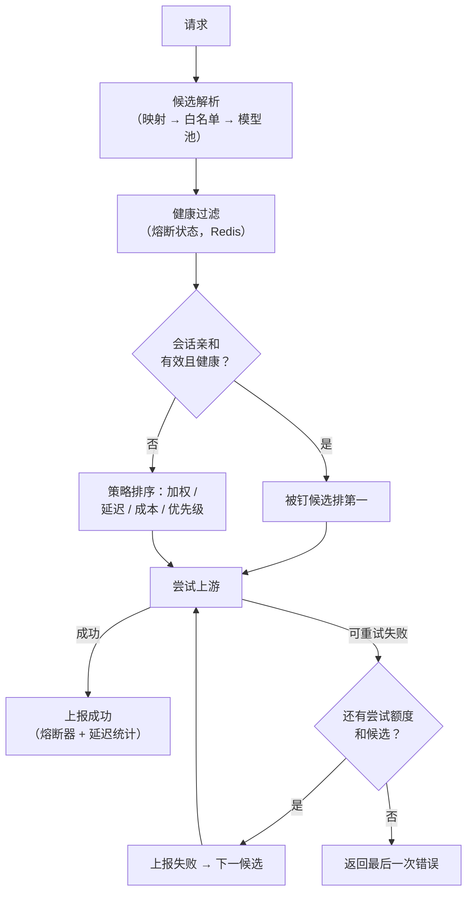
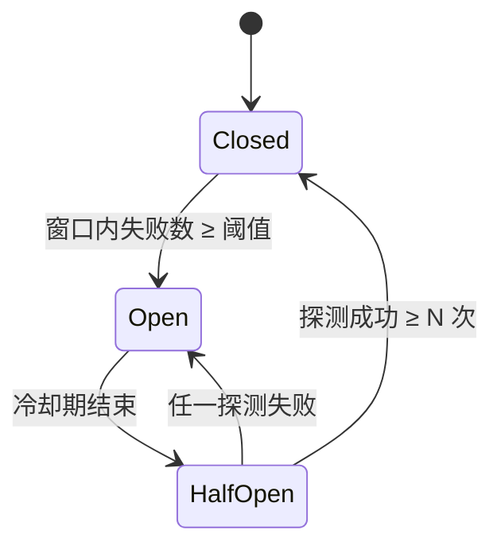

# D01 · 路由与负载均衡

> [English version](../../design/01-routing-and-lb.md) · [ai-gateway 文档套件](../README.md)的一部分

| | |
| --- | --- |
| **阶段** | P0（核心）；延迟/成本策略 P1 |
| **依赖** | [D05 可观测性](05-observability.md)（路由策略消费的延迟数据） |
| **被依赖** | [D02 协议适配](02-protocol-adapters.md)（路由选提供方，适配器与之对话）、[D07 缓存](07-caching-strategies.md) |

## 背景

今天网关选择提供方和模型基本靠随机：

- `resolveTargetModel()` / `resolveExactTargetModel()`（`internal/biz/gateway.go:804,842`）回退到对允许模型列表或提供方模型池做 `mrand.IntN`。
- `AIProvider.Weight`（`internal/data/model/provider.go:28`）在 schema 中存在、默认 100，但**没有任何地方读取它**。
- `AIProvider.IsHealthy()` 原样返回 `IsEnabled` —— 健康是运维手动开关的布尔值，不是被观测到的事实。
- `ProxyRequest()`（`internal/biz/gateway.go:486`）只做一次上游尝试；任何上游失败直接透传给客户端。
- 会话亲和（`resolveSticky()`，`gateway.go:774`）把请求钉在某个提供方上，该提供方劣化时没有逃生口——它只查 DB 里的 `is_enabled`。

后果：单一提供方故障，对所有被钉住或路由到它的 Key 就是全量故障。对一个把"多供应商负载均衡"写进卖点的产品，这是最需要优先弥补的缺口，它也是 P0 发布的门槛（[路线图 P0-1](../03-roadmap.md)）。

## 目标

1. 确定性的、可配置的提供方/模型选择策略（先加权；延迟与成本感知随后）。
2. 可重试的上游失败自动在候选间重试与故障转移。
3. 基于被动观测失败的熔断，多实例共享。
4. 被钉住的提供方熔断时，会话亲和优雅让路。
5. 零新增基础设施：状态放 Redis、配置放 MySQL，与现有模式一致。

非目标：并发槽之外的请求排队/卸载；跨提供方的全局速率协调（提供方级配额是未来工作）。

## 设计总览



关键结构性变化：模型解析不再返回**一个** `(model, providerID)`，而是返回**有序候选列表**。其余一切（熔断、重试、亲和降级）都围绕这个列表组合。

### 新增 biz 组件：`RouterManager`

沿用 `QuotaManager` 的先例（`internal/biz/quota.go`）：由 Wire 注入、持有 Redis 状态与小型 Lua 脚本的结构体，被 `GatewayUseCase` 消费。

```go
// internal/biz/router.go
type RouteCandidate struct {
    ProviderID uint
    Model      string
    ViaMapping bool
    Priority   int // 越小越优先；同层由策略决定
}

type RouterManager struct { /* rdb, db, logger */ }

// Rank 过滤不健康候选，按 Key 的策略对其余排序。
func (rm *RouterManager) Rank(ctx context.Context, key *model.AIVirtualKey, cands []RouteCandidate) []RouteCandidate

// ReportResult 在每次尝试后喂给熔断器与延迟 EWMA。
func (rm *RouterManager) ReportResult(ctx context.Context, providerID uint, model string, outcome AttemptOutcome)

// Healthy 暴露熔断状态（也被会话亲和降级与 /metrics 消费）。
func (rm *RouterManager) Healthy(ctx context.Context, providerID uint) BreakerState
```

## 选择策略

策略按虚拟 Key 配置（`AIVirtualKey` 新增列 `routing_strategy`，空 = 继承全局默认 `weighted`）。显式指定提供方的模型映射会绕过策略——这是刻意的：映射是指令，不是提示。

| 策略 | 行为 | 阶段 |
| --- | --- | --- |
| `weighted`（默认） | 对最高优先级层的候选做平滑加权轮询，使用 `AIProvider.Weight`。权重 0 = 排水（不进新流量，存量亲和继续尊重）。 | P0 |
| `priority` | 严格按 `Priority` 排序；仅当上层所有提供方都处于熔断打开时才落到下层。这就是"降级链"策略。 | P0 |
| `least_latency` | 优先选取每个 `(provider, model)` 最近 TTFT/延迟 EWMA 最低者，带抖动避免羊群效应。延迟来源：与导出到 Prometheus 相同的按次观测（[D05](05-observability.md)）。 | P1 |
| `least_cost` | 优先选取 `AIModelItem` 定价中有效输入+输出价最低者（`credits.go` 已在加载这些价格）。 | P1 |

平滑加权轮询的状态（当前有效权重）保存在按候选集哈希划分的 Redis hash 中，由小型 Lua 脚本变更——跨实例原子，网关实例保持无状态。

### 降级链

降级链用优先级层表达，而不是另起概念：候选携带 `Priority`，`priority` 策略（或任何策略下的熔断耗尽）逐层下探。链配置在模型映射上（`AIModelMapping` 新增可空 JSON 列 `fallback_chain`：有序 `[{provider_id, model}]`）。刻意复用映射表——映射本来就是"每个 Key 的路由意图所在之处"。

## 健康：熔断器

### 决策（ADR）

- **背景：** 健康状态必须跨实例共享（从未向提供方 X 发过流量的实例也应知道 X 挂了），且不能给热路径增加 DB 依赖。
- **选项：** (a) 各实例内存熔断器；(b) `ai_provider_health` MySQL 表；(c) Redis 熔断状态 + MySQL 事件记录。
- **决策：** (c)。每个提供方一个 Redis hash 存实时状态；状态*迁移*通过现有异步事件模式落库（仿照 `QuotaEvent`（`internal/data/model/quota_event.go`）的 `RouterEvent`），供运维可见与控制台时间线。
- **后果：** 熔断读取给每个请求加一次 Redis 调用——用现有 L1 缓存模式缓解（60 s 本地 TTL 对熔断太慢；用 1–2 s 的本地微缓存）。Redis 挂掉时熔断器**失败开放**（所有提供方视为健康）——Redis 丢失本来就会使配额失效，且按设计原则 6，经济/韧性类失败开放。

### 状态机



Redis 布局（遵循 `ai:gw:` 约定）：

```text
ai:gw:cb:{providerID}          # hash: state, fail_count, window_start, opened_at, probe_ok
ai:gw:lat:{providerID}:{model} # hash: ewma_ms, ttft_ewma_ms, updated_at
```

默认值（可经 `AIProvider` 新增 JSON 列 `breaker_config` 按提供方覆盖）：30 s 内失败 5 次触发，冷却 30 s，半开探测额度 3。计为失败：连接错误、超时、HTTP 5xx、429。**不**计入：429 之外的 4xx（调用方错误）、护栏阻断、配额拒绝。

被动检查是 P0 机制。可选的主动探测（周期性对提供方 `GET /models`）是 P1 附加项，用于空闲期的恢复探测，默认关闭。

## 重试与故障转移

在 `ProxyRequest()` 现有的单次上游调用外面加尝试循环：

1. 构建排序后的候选（已过熔断过滤、已按亲和重排）。
2. 尝试候选 1。成功 → 上报成功，结束。
3. **可重试**失败 → 上报失败，尝试下一候选。预算：总尝试 `min(3, len(candidates))` 次，另有墙钟重试预算（默认 10 s），保证重试永不冲破代理超时。
4. 全部失败 → 返回*最后一次*上游错误（最近的信息量最大），每次尝试都写审计（审计条目新增 `attempt_seq`/`attempts_total` 列，多次尝试的请求可完整还原）。

可重试矩阵：

| 条件 | 重试？ | 备注 |
| --- | --- | --- |
| 连接错误 / TLS 失败 | ✅ | |
| 首字节前超时 | ✅ | |
| HTTP 429、500、502、503、529 | ✅ | 429 同时喂熔断器 |
| **流式：首个 chunk 已发给客户端后的失败** | ❌ | 响应已经承诺；中止。这是硬边界——只有在字节到达客户端*之前*故障转移才是安全的。 |
| HTTP 400/401/403/404 | ❌ | 确定性错误；换个提供方同样的请求通常同样失败——例外是 401/403：它们*为该提供方*打开熔断（上游 Key 坏了），但不重试该请求。 |
| 请求体 > 1 MiB 已流式发往上游 | ❌ | 重试要求请求体可重放；现有代码会缓冲请求体，此项仅对未来的流式上传支持有意义。 |

幂等性：chat/embeddings/rerank 的 POST 只有在**没有任何响应字节被转发**时才可安全重发——上面的规则恰好编码了这一点。P0 不需要 idempotency-key 机制。

## 会话亲和的整合

`resolveSticky()` 目前是硬钉。改为：亲和成为*重排*输入，而不是覆盖。

- 被钉提供方熔断 `Closed` → 被钉候选排到第 1（保留现有行为）。
- `Open` → 本次请求跳过钉住，**不清除** sticky 记录（提供方可能在会话 TTL 内恢复；清除会造成亲和抖动）。
- `HalfOpen` → 只有该请求抢到探测名额时才钉住；否则路由到别处。
- `resolveSticky()` 中现有的 `is_enabled` DB 检查并入熔断过滤（运维停用 ⇒ 视为永久 `Open`），顺带去掉每请求一次的 DB count 查询——热路径小赚一笔。

## 数据模型变更

全部为加法（路线图不变量 2）：

| 表 | 变更 |
| --- | --- |
| `ai_virtual_keys` | `routing_strategy varchar(32)` —— 空 = 全局默认 |
| `ai_providers` | `breaker_config json`（可空）、`priority int default 0` |
| `ai_model_mappings` | `fallback_chain json`（可空） |
| `ai_gateway_audit_logs` | `attempt_seq int`、`attempts_total int`、`provider_attempts json`（逐次的提供方/错误/延迟） |
| 新表 `ai_gateway_router_events` | 熔断迁移：provider_id、from_state、to_state、reason、created_at（仿 `QuotaEvent`） |

## 涉及代码

| 位置 | 变更 |
| --- | --- |
| `internal/biz/router.go`（新增） | `RouterManager`、策略、熔断器、Lua 脚本 |
| `internal/biz/gateway.go` `resolveTargetModel` / `resolveExactTargetModel` | 返回 `[]RouteCandidate` 而非单对；删除两处 `mrand.IntN` |
| `internal/biz/gateway.go` `ProxyRequest` | 尝试循环、重试预算、逐次审计字段、`ReportResult` 调用 |
| `internal/biz/gateway.go` `resolveSticky` | 上述熔断感知重排 |
| `internal/biz/gateway.go` `loadProviderDirect` | 不变；每次尝试调用 |
| `cmd/server/wire.go` | `NewRouterManager` 加入 `biz.ProviderSet`；重新生成 `wire_gen.go` |

## 可观测性挂钩

经 [D05](05-observability.md) 导出：`aigw_upstream_attempts_total{provider,model,outcome}`、`aigw_breaker_state{provider}`（gauge 0/1/2）、`aigw_failover_total{from_provider,to_provider}`、按次延迟直方图。熔断迁移同时产生 `RouterEvent` 行，供控制台时间线使用。

## 测试与验证

- 单元：策略排序（1 万次抽样的加权分布与配置权重偏差 ±5% 内）、熔断状态机迁移、可重试错误矩阵。
- 集成（httptest 伪提供方）：负载中杀掉提供方 A → 流量在熔断窗口内切到 B；恢复 A → 半开探测后流量回归；流式首 chunk 后的失败**不**重试。
- [路线图](../03-roadmap.md)中的 P0 出口标准（"杀掉两个提供方之一，除在途请求外零用户可见错误"）就是本文档的整体验收测试。

## 实现笔记（ADR 附录）

**模型映射管理 CRUD + 控制台故障转移链拖拽编辑器。**`AIModelMapping`（虚拟模型名 → 真实模型 + `fallback_chain` 这一行，路由器早就在热路径上通过 `resolveModelMapping`/`matchModelMapping` 解析它）此前除了直接写库之外没有任何创建/编辑手段。`internal/biz/model_mapping_admin.go` 在 `/ai/gateway/model-mappings` 上新增 Create/List（按 `virtual_key_id`，预加载 `RealModel`）/Update/Delete——沿用 MCP 服务器/扩展已有的管理 CRUD 写法（全局对象姿态：仅平台管理员可写；按 Key 归属租户做 RBAC 校验属于进一步增量，与本项目已记录的"广泛租户范围过滤"缺口保持一致）。控制台的 `ModelMappings.tsx` 页面把虚拟 Key 选择器、映射表格与创建/编辑表单组合在一起；故障转移链本身是一个 `@dnd-kit/core` + `@dnd-kit/sortable` 可拖拽排序的 `{providerId, model}` 行列表（新增行选择提供方并填入模型名；拖拽手柄调整顺序；逐行删除），直接序列化进已有的 `fallback_chain` JSON 列——没有新增列，没有新增解析逻辑，纯粹是把路由器早就会读的东西补上一个可编辑的入口。
