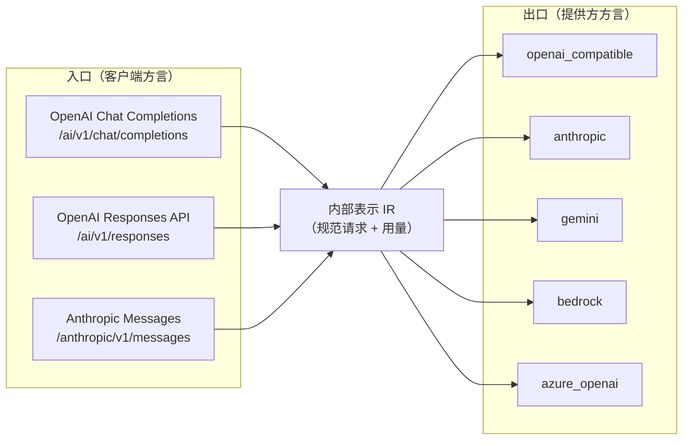

# D02 · 协议适配

> [English version](../../design/02-protocol-adapters.md) · [ai-gateway 文档套件](../README.md)的一部分

| | |
| --- | --- |
| **阶段** | P2（Batch/Files API 为 P3） |
| **依赖** | [D01 路由](01-routing-and-lb.md)（路由选定提供方，适配器讲它的方言） |
| **被依赖** | [D03 计费](03-billing-and-monetization.md)与审计（消费归一化用量）、[D07 缓存](07-caching-strategies.md) |

## 背景

今天所有提供方都被假定为 OpenAI 兼容：`AIProvider.ProviderType` 默认 `openai_compatible`，除路径重写外没有任何分支（`rewriteOpenAIPathForProvider()` 处理 DashScope 的 rerank 路径）。这意味着：

- Anthropic、Gemini、Bedrock 的模型只能通过第三方兼容层间接接入——提供方选择被方言而非质量与价格约束。
- 基于 Anthropic SDK 构建的客户端（越来越常见：Claude Code、MCP 工具链）完全无法使用网关。
- 用量核算默默假设 OpenAI 的 `usage` 形状；其他方言的缓存 Token、推理 Token 字段会被丢弃，污染计费。

适配层在两个方向上消除方言约束，这是 P2 出口标准的前提：*Claude SDK 客户端与 OpenAI SDK 客户端调用同一虚拟 Key、落到同一 Gemini 提供方，用量正确*。

## 协议矩阵

两条独立的轴。网关的内部表示（IR）居中，工作量是 `N + M` 个翻译器，而不是 `N × M`。



按需求排序的落地顺序：出口 `anthropic` → `gemini` → `azure_openai` → `bedrock`；入口 `anthropic messages` → `responses`。`openai_compatible` 保持为恒等适配器与默认值，今天的行为分毫不差地保留。

### 快速路径保证

入口方言 == 出口方言时（OpenAI→openai_compatible，绝大多数流量），适配层**不得**经过 IR 往返。恒等适配器直接透传请求体，只做现有的定点变更（`replaceModelInBody()`、`injectStreamUsageOption()`、`injectPromptCacheKey()`、`injectModelExtraParams()`）。完整的解析/序列化只在真正需要转换时支付。这守住了热路径预算（设计原则 5）。

## 内部表示

不是所有 API 的无损并集，而是**面向路由与核算**的规范形态，外加透传扩展袋：

```go
// internal/biz/protocol/ir.go
type ChatRequest struct {
    Model       string
    Messages    []Message      // role、content parts（text/image/audio/tool_call/tool_result）
    System      string         // Anthropic 单列、OpenAI 内嵌 —— IR 单列
    Tools       []Tool
    Stream      bool
    MaxTokens   *int
    Temperature *float64
    // ... 其他一等公民的通用参数
    Extensions  map[string]json.RawMessage // 方言特有参数：出口方言认识则转发，否则丢弃并在审计中注记
}

type Usage struct {
    InputTokens        int
    OutputTokens       int
    CacheReadTokens    int // OpenAI: prompt_tokens_details.cached_tokens · Anthropic: cache_read_input_tokens
    CacheWriteTokens   int // Anthropic: cache_creation_input_tokens · 其他方言缺席
    ReasoningTokens    int // OpenAI: completion_tokens_details.reasoning_tokens · Gemini: thoughtsTokenCount
    Raw                json.RawMessage // 提供方原生 usage 对象，保留在审计中以备溯源
}
```

`Usage` 是 `writeAuditLog()`、`QuotaManager.CommitTokens()` 与 `calcCredits()` 消费的唯一形状（`internal/biz/credits.go` 已经单独为缓存读 Token 定价——IR 让非 OpenAI 方言也终于能喂上这个字段）。

## 适配器接口

```go
// internal/biz/protocol/adapter.go

// OutboundAdapter 讲一种提供方方言。由 AIProvider.ProviderType 选择。
type OutboundAdapter interface {
    // BuildRequest 将 IR 映射为提供方 HTTP 请求（BaseURL + 方言路径、认证头风格、请求体）。
    BuildRequest(ctx context.Context, p *model.AIProvider, req *ChatRequest) (*http.Request, error)
    // ParseResponse 将非流式提供方响应映射为 IR 响应 + 归一化 Usage。
    ParseResponse(resp *http.Response) (*ChatResponse, *Usage, error)
    // StreamDecoder 将提供方 SSE/分块流包装为 IR 事件流。
    StreamDecoder(body io.Reader) StreamDecoder
}

// InboundCodec 讲一种面向客户端的方言。由路由选择。
type InboundCodec interface {
    DecodeRequest(r *http.Request) (*ChatRequest, error)
    EncodeResponse(w http.ResponseWriter, resp *ChatResponse) error
    // StreamEncoder 以客户端期待的线格式写出 IR 流事件，
    // 包括方言正确的事件名、role 增量与终止符（[DONE] vs message_stop）。
    StreamEncoder(w http.ResponseWriter) StreamEncoder
}
```

注册是编译期的（经 Wire 注入的注册表 `map[string]OutboundAdapter`，不搞 `init()` 魔法），符合项目"无运行时魔法"的立场；社区适配器以"一个包 + 一行注册"的 PR 形式到来。`rewriteOpenAIPathForProvider()` 并入 `openai_compatible` 适配器的 `BuildRequest`，独立函数删除。

### 流式转换

困难的那 20%。设计规则：

1. **事件级状态，而非 Token 级。** 翻译器为每条流维护小型状态机（当前 tool-call 序号、content block 序号）——Anthropic 的 `content_block_start/delta/stop` 与 OpenAI 带下标的 `tool_calls` 增量互相映射。
2. **usage 到达时机各不相同**（OpenAI：配 `stream_options.include_usage` 的最终 chunk；Anthropic：`message_delta`；Gemini：chunk 上的 `usageMetadata`）。解码器无论来源如何都发出终结的 `UsageEvent`；审计/计费只消费它。
3. [D01](01-routing-and-lb.md) 的**首 chunk 承诺规则**原样适用：编码器写出第一个字节后，故障转移关闭。
4. 每 chunk 开销预算：p99 < 5 ms（P2 出口标准）——翻译器不得缓冲整个响应；它们以 chunk 进、事件出的方式工作。

### 认证与端点方言

| ProviderType | 认证 | 路径形态 | 备注 |
| --- | --- | --- | --- |
| `openai_compatible` | `Authorization: Bearer` | `/v1/chat/completions` | 今天的行为 |
| `anthropic` | `x-api-key` + `anthropic-version` | `/v1/messages` | 版本头按提供方可配 |
| `gemini` | `x-goog-api-key`（或 OAuth） | `/v1beta/models/{model}:generateContent` / `:streamGenerateContent` | 模型在*路径*里——URL 构造归 `BuildRequest` 所有 |
| `azure_openai` | `api-key` 头 | `/openai/deployments/{deployment}/chat/completions?api-version=…` | deployment 名 ≠ 模型名：存于 `AIModelItem` 扩展参数 |
| `bedrock` | SigV4 签名 | `/model/{modelId}/invoke(-with-response-stream)` | 提供方配置需 AWS 凭证；其流式线格式（event-stream）有独立解码器 |

提供方特有设置（anthropic-version、api-version、region、deployment 映射）放入 `ai_providers` 新增的可空 JSON 列 `adapter_config`。

## 入口

在 `internal/server/http.go` 注册新路由，由同一个 `virtual_key_auth` 中间件守卫：

- `POST /anthropic/v1/messages` —— Anthropic Messages 编解码器。除 Bearer 外也接受 `x-api-key: sk-vk-*`（Anthropic SDK 惯例）。
- `POST /ai/v1/responses` —— OpenAI Responses API 编解码器，映射到 IR（先做无状态子集；`previous_response_id` 链式调用在需求被证明前不做——记为开放问题）。

模型解析、配额、路由、审计、计费全部与方言无关，因为它们在解码后的 IR 上运行。

## 数据模型变更

| 表 | 变更 |
| --- | --- |
| `ai_providers` | `adapter_config json`（可空） |
| `ai_model_items` | Azure deployment 映射复用现有扩展参数（无 schema 变更） |
| `ai_gateway_audit_logs` | `inbound_protocol varchar(32)`、`cache_write_tokens int`、`reasoning_tokens int`（缓存读已在计费路径中） |

## 涉及代码

| 位置 | 变更 |
| --- | --- |
| `internal/biz/protocol/`（新包） | IR、适配器/编解码接口、注册表、各方言实现 |
| `internal/biz/gateway.go` `ProxyRequest` | 入口编解码 → IR 管线 → 出口适配器；保留快速路径 |
| `internal/biz/gateway.go` 请求体变更辅助函数 | 并入恒等适配器 |
| `internal/server/http.go` | 新入口路由 |
| `internal/biz/credits.go` `calcCredits` | 接受 `Usage`（补上缓存写定价，`AIModelItem.CacheWritePricePerMillion` 已有价格字段） |

## 测试与验证

- 各适配器的 golden-file 测试：录制的提供方 fixture（请求/响应/流转录）→ 断言精确的 IR 与精确的重编码输出。fixture 即契约；提供方 API 漂移体现为 fixture diff。
- 跨方言矩阵测试：每个入口编解码 × 每个出口适配器，跑一段规范会话（文本 + 工具调用 + 流式），断言归一化 `Usage` 相等。
- 快速路径压测：证明 OpenAI→openai_compatible 相对适配层引入前的基线零新增分配/延迟。

## 实现说明（ADR 补记）

本轮把这份文档里的矩阵全部落地——入站 Anthropic Messages（`/anthropic/v1/messages`）、OpenAI Responses（`/ai/v1/responses`），出站 bedrock——但内部形态与上文设计有出入。

- **IR 决策**：没有新建 `internal/biz/protocol/` 包或独立的 `ChatRequest`/`ChatResponse` 结构体。`internal/biz/protocol.go` 自己的文档注释早已断言"内部表示就是 OpenAI Chat Completions 的线上格式"，且现有每个出站方言（anthropic、gemini、azure_openai）都已经围绕它转，测试覆盖也很完整。与其推倒重来引入一套结构体 IR，新的入站编解码器只在两端做翻译（请求解码、响应/流编码），复用同一个 OpenAI 形状枢纽。这让快速路径保证天然成立——OpenAI 入→openai_compatible 出这条路径完全没被本轮改动碰过——也让"新入站 × 既有出站"保持在 N+M 而不是 N×M 的重写。代价：这个 IR 偏 OpenAI 形状而非中立联合体；可接受，因为计费/审计从来只关心 `internal/biz/credits.go` 已经建模的那些字段。
- **响应重编码**：没有做 `InboundCodec` 接口 + 注册表，而是给每条新入站路由包一层轻量的 `http.ResponseWriter` 包装器（`anthropicResponseWriter`/`responsesResponseWriter`）：非流式响应整体缓冲、在 `Close()` 时翻译（成功响应和网关自己写的 `{"error":...}` 错误体都靠一个结构性判断分派，所以 PII 拦截、限流、计费 402、全部候选失败 502 等既有错误路径全部自动获得正确的目标方言形状）；流式响应通过一个翻译 goroutine 管道转发。`ProxyRequest` 本身完全没有改动。
- **Bedrock 范围**：只支持 Bedrock 原生 Invoke API 上的 Anthropic Claude 模型，不是上面表格里泛化的"任意模型"场景。其他 Bedrock 模型族的 invoke body 形状互不兼容；后续要加是有边界的追加工作（多一个分支 + 一套 fixture），不是重新设计。SigV4 手写实现（`internal/biz/bedrock/`，对 `biz` 无依赖），没有引入 aws-sdk-go；测试里用一份独立编写的 Python 参考实现做交叉校验，而不是在 Go 里把同一套算术又推导一遍。
- **Bedrock 凭证**：`AIProvider.APIKey`（每种方言都在用的那一个 AES-256-GCM 加密字符串列）对 `bedrock` 类型 provider 存一段 JSON `{"accessKeyId","secretAccessKey","sessionToken"}`，没有新增专用列。Region 不是密钥，放在 `adapter_config` 里，和 anthropic/azure 自己的方言设置一样。
- **缓存写/推理 token**：`anthropicToOpenAIResponse`/`translateAnthropicStream` 现在也会带出 `cache_creation_input_tokens`（之前解析了但静默丢弃），`calcCredits` 通过 `AIModelItem.CacheWritePricePerMillion`（这个价格列从本设计最初版本就有，但从未被读取过）计费——这是一个真实缺口而不是顺手加戏，因为一旦有真实的 Anthropic Messages 客户端，这个缺口立刻用户可见。`reasoning_tokens` 是 `AIGatewayAuditLog` 上新增的纯展示型列（推理 token 在计费口径上已经是 `completion_tokens` 的子集，和 OpenAI 自己的用量形状一致）。
- **明确排除的范围**：Responses API 的 `previous_response_id` 串联与 `store:true` 直接拒绝（400），而不是假装支持——网关没有服务端 Responses 状态持久化，这把本设计原本的 open question 明确判定为"不支持"而不是继续含糊。Responses/Anthropic 的流式事件覆盖只做了最常用的子集，不是两套 API 各自完整事件分类法的全量对齐。`adapter_config`/bedrock 凭证的控制台 UI 仍是仅 API 可用。
