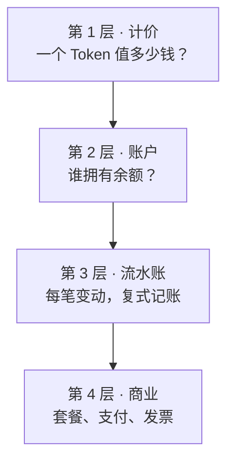
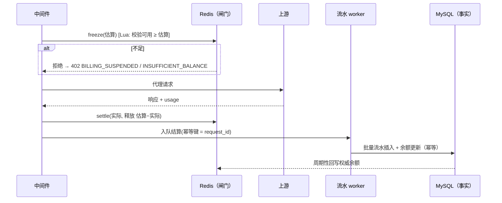

# D03 · 计费与商业化

> [English version](../../design/03-billing-and-monetization.md) · [ai-gateway 文档套件](../README.md)的一部分

| | |
| --- | --- |
| **阶段** | P1（计价、账户、流水、扣减、预算） · P2（套餐、支付、发票） |
| **依赖** | [D04 多租户](04-multi-tenancy-and-auth.md)（账户挂在租户上）、[D02 协议适配](02-protocol-adapters.md)（归一化用量）、审计溯源 |
| **被依赖** | [D08 Web 控制台](08-web-console.md)计费中心 |

## 背景

`internal/biz/credits.go` 今天只做成本计算：从 `AIModelItem` 取模型价格（百万 Token 的输入/输出/缓存读/缓存写价），从 `ai_credits_rates` 取 CNY-积分汇率，`calcCredits()` 产出 `(credits, microCredits, costCNY)`。积分随后被 `QuotaManager` *限速*——但没有任何东西被**持有、扣减或结算**。没有余额、没有交易记录、没有停用、没有向任何人收钱的手段。币种硬编码（`getCNYRatePerCredit`，键 `ai:gw:credits:rate:CNY`）。

愿景承诺了完整的转售商闭环（[画像 2](../01-product-vision.md)）：充值 → 消费 → 归零停用 → 开票。本文按四层设计，部署方按需取用深度——平台团队可能止步于第 2 层（showback），转售商用满四层。



## 第 1 层 · 计价

### 目标

把**成本**（上游向运营者收的钱）与**售价**（运营者向租户收的钱）解耦；支持任意币种；支持按客户分组的差异化定价。

### 设计

- `AIModelItem` 的百万 Token 价格重新定义为**成本**（上游侧）。schema 不变；`least_cost` 路由（[D01](01-routing-and-lb.md)）与毛利报表读的就是它。
- 新增 `ai_price_tables`：命名的售价集合。租户引用一张价格表；未引用 → 默认表；表中缺某模型 → 回退到成本（毛利 0），严格转售商可配置为*拒绝*。
- `ai_credits_rates` 泛化到任意币种（它已有 `currency` 列）；`getCNYRatePerCredit()` 变为 `getRatePerCredit(currency)`，Redis 键参数化为 `ai:gw:credits:rate:{currency}`。账户余额以**微积分**存储（`credits.go` 中的 `microCreditScale = 1_000_000` 约定），币种只在展示与支付时施加——内部运算保持整数、无币种。

**`ai_price_tables`** / **`ai_price_table_items`**

| 列 | 类型 | 备注 |
| --- | --- | --- |
| `id` / `created_at` / `updated_at` / `deleted_at` | | GORM 标准 |
| `name` | varchar(64) uniqueIndex | |
| `currency` | varchar(8) | 展示 + 支付币种 |
| `is_default` | bool | biz 层保证有且仅有一个 |

| 列（items） | 类型 | 备注 |
| --- | --- | --- |
| `price_table_id` | uint index | |
| `model_pattern` | varchar(128) | 精确或正则，匹配语义与 `matchModelMapping()` 相同 |
| `input_price_per_million` … `cache_write_price_per_million` | decimal(18,6) | 售价，以表币种计 |
| `tier_config` | json 可空 | 可选量级阶梯 `[{from_tokens, price…}]` —— 按账户按月评估 |

## 第 2 层 · 账户

每个**租户**一个余额账户（不是每个 Key——Key 是凭证，租户才是客户；Key 级消费上限仍是配额系统的职责）。

**`ai_billing_accounts`**

| 列 | 类型 | 备注 |
| --- | --- | --- |
| `tenant_id` | uint uniqueIndex | 来自 [D04](04-multi-tenancy-and-auth.md) |
| `mode` | varchar(16) | `prepaid` / `postpaid` |
| `balance_micro` | bigint | 预付：≥ 停用水位；后付：可负至 `credit_limit_micro` |
| `frozen_micro` | bigint | 在途冻结之和 |
| `credit_limit_micro` | bigint | 后付上限；预付透支额度（默认 0） |
| `price_table_id` | uint 可空 | null = 默认表 |
| `low_watermark_micro` | bigint | 预算告警阈值 |
| `status` | varchar(16) | `active` / `grace` / `suspended` |
| `grace_until` | datetime 可空 | |
| `version` | bigint | 对账任务的乐观锁 |

### 停用策略

余额 ≤ 0（预付）或 ≤ −credit_limit（后付）⇒ 账户进入 `grace`（可配窗口，默认 24 h，0 = 立即），随后 `suspended`。suspended ⇒ 中间件在配额检查*之前*以 kratos 错误 `ErrBillingSuspended`（kerrors code 402，reason `BILLING_SUSPENDED`）拒绝。充值回正 ⇒ 立即 `active`。进入 `grace` 时与触及低水位时经 [D08](08-web-console.md) 设置的通知通道告警。

## 第 3 层 · 流水账与扣减流程

### 决策（ADR）：冻结 → 结算，镜像配额模式

- **背景：** 响应完成前不知道确切成本（流式 usage 最后到达）；计费在响应与结算之间崩溃时不能丢钱，也不能给热路径加阻塞式 DB 写。
- **选项：** (a) 只在响应后结算（风险：零余额下的并发超支无界）；(b) 每请求同步 DB 事务（违反热路径预算）；(c) 请求开始时 Redis 冻结 + 异步 DB 结算——正是 `QuotaManager.CheckAndReserve()`/`CommitTokens()` 与并发槽保留/释放的形状。
- **决策：** (c)。Lua 脚本按*估算值*（由 `max_tokens` 与价格表计算，带下限默认值）向 Redis 镜像的可用余额冻结；响应后释放估算与实际的差额，并把结算记录排队给流水写入器（仿 `AuditWorker` 的批处理异步 worker）。Redis 是实时闸门；MySQL 是事实来源，持续对账。
- **后果：** 最坏超支被 (冻结低估 × 在途请求数) 约束——可接受且可经估算下限调节。冻结与结算之间崩溃留下带 TTL 的冻结（TTL = 代理超时 + 余量）自动释放；对账任务重放缺少流水的审计行。按设计原则 6，Redis 计费状态不可用时网关**失败开放**、事后对账（严格转售商可配为失败关闭）。



### `ai_billing_ledger`

只追加。每行恰好移动一次价值；余额永远可由租户流水求和重建（用不变量测试固化——P1 出口标准）。

| 列 | 类型 | 备注 |
| --- | --- | --- |
| `id` | bigint pk | |
| `account_id` | uint index | |
| `entry_type` | varchar(16) | `recharge` / `deduct` / `refund` / `adjust` / `freeze_expire` |
| `amount_micro` | bigint | 有符号：入正出负 |
| `balance_after_micro` | bigint | 变动后余额快照 |
| `idempotency_key` | varchar(64) uniqueIndex | 扣减用 request_id；充值用支付单号——重放安全 |
| `ref_type` / `ref_id` | varchar(16) / varchar(64) | 出处：`audit_log` / `payment_order` / `manual` —— 满足设计原则 7（每张发票行可追溯到审计行） |
| `operator_id` | uint 可空 | 手工调整用 |
| `remark` | varchar(256) | |
| `created_at` | datetime index | |

### 报表

- 原始归集查询复用审计表（它已携带 Key、提供方、模型、Token、项目标签）。
- 新增 `ai_usage_daily` 预聚合（租户 × 项目 × Key × 模型 × 日：请求数、分类 Token、cost_micro、price_micro），由流水 worker 内的定时任务维护。控制台图表与 CSV/发票生成只读这张表——审计表不为分析背索引负担。

## 第 4 层 · 商业（P2）

### 订阅套餐

**`ai_billing_plans`**：`name`、`price_micro`、`currency`、`period`（`monthly`/`yearly`）、`granted_credits_micro`、`quota_template json`（套餐附赠的默认 Key 配额）、`price_table_id`、`is_enabled`。

**`ai_billing_subscriptions`**：`tenant_id`、`plan_id`、`status`（`active`/`past_due`/`canceled`）、`period_start`、`period_end`、`auto_renew`。续费 = 一笔 `ref_type=subscription` 的流水充值。期末未用完的附赠额度：按套餐标志作废或结转。

### 支付网关抽象

```go
// internal/biz/payment/gateway.go
type PaymentGateway interface {
    Name() string // "stripe" / "alipay" / "wechat"
    CreateOrder(ctx context.Context, o *PaymentOrder) (payURL string, err error)
    VerifyWebhook(r *http.Request) (*WebhookEvent, error) // 验签是网关适配器的职责
    QueryOrder(ctx context.Context, orderNo string) (OrderStatus, error) // 主动对账
}
```

适配器：Stripe（Checkout + webhook）、支付宝（电脑网站支付 + 异步通知）、微信支付（Native 扫码 + 通知）。与协议适配器（[D02](02-protocol-adapters.md)）相同的编译期注册表模式。Webhook 端点是免认证路由，但逐网关验签；所有 webhook 经 `ai_payment_orders.order_no` 幂等。

**`ai_payment_orders`**：`order_no`（uniqueIndex，ULID）、`account_id`、`gateway`、`amount_micro`、`currency`、`status`（`pending`/`paid`/`failed`/`expired`/`refunded`）、`gateway_txn_id`、`paid_at`、`raw_notify json`。状态只前进；`paid` 恰好触发一笔流水充值（幂等键 = order_no）。

对账：定时任务对超过 N 分钟的 `pending` 订单调用 `QueryOrder`——webhook 会丢；轮询是安全网。

### 发票

**`ai_invoices`**：`invoice_no`、`account_id`、`period_start/end`、`amount_micro`、`currency`、`line_items json`（由 `ai_usage_daily` 生成）、`status`（`draft`/`issued`/`void`）、`pdf_ref`（对象存储指针，可选）。税务处理明确**不在范围内**——这里的发票是商业记录；财税开票（电子发票、增值税）经事件总线（[D09](09-extensibility.md)）对接外部系统。

## 涉及代码

| 位置 | 变更 |
| --- | --- |
| `internal/biz/billing.go`（新增） | `BillingManager`：冻结/结算 Lua、账户状态机、停用 |
| `internal/biz/billing_worker.go`（新增） | 批量流水写入 + 对账 + 按日聚合（克隆 `AuditWorker` 模式） |
| `internal/biz/payment/`（新增） | 网关接口 + 适配器（P2） |
| `internal/biz/credits.go` | 币种泛化；在成本之外暴露价格表感知的 `calcPrice()` |
| `internal/middleware/virtual_key_auth.go` | Key 解析之后、配额保留之前的计费闸门（停用检查 + 冻结） |
| `internal/biz/gateway.go` `ProxyRequest` | 在现有 `CommitTokens` 旁边加结算调用 |
| `internal/biz/errors.go` | `ErrBillingSuspended`、`ErrInsufficientBalance`（kerrors 402） |
| `cmd/server/wire.go` | 新 provider；重新生成 |

## 测试与验证

- 属性测试：冻结/结算/过期/充值的任意交错下，`balance_after_micro` 链保持一致，Redis 与 MySQL 漂移在在途上界内。
- 幂等：所有 webhook 与所有结算重放两次，一切不变（由 uniqueIndex 断言）。
- P1 出口端到端流程：充值 → 消费到零 → 402 → 充值 → 恢复（见[路线图](../03-roadmap.md)）。
- 支付适配器在 CI 中对沙箱环境测试（每夜、凭证门控），验签单测使用录制 fixture。
