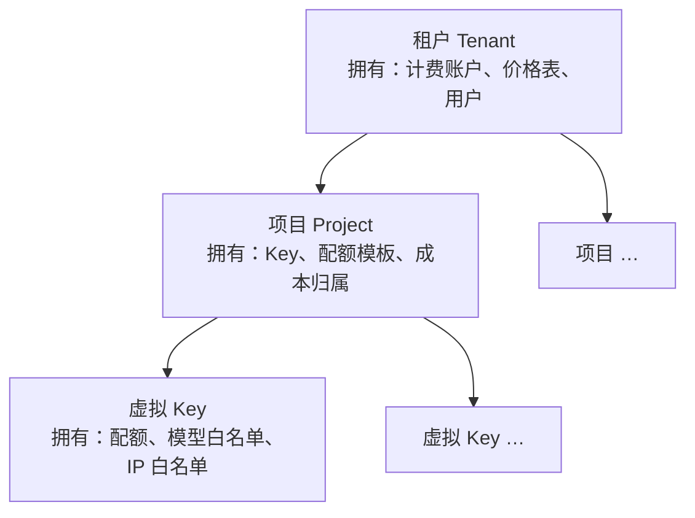

# D04 · 多租户与管理面认证

> [English version](../../design/04-multi-tenancy-and-auth.md) · [ai-gateway 文档套件](../README.md)的一部分

| | |
| --- | --- |
| **阶段** | P0（admin token） · P1（租户、用户、RBAC） · P2（OIDC/SSO） |
| **依赖** | ——（地基文档） |
| **被依赖** | [D03 计费](03-billing-and-monetization.md)（账户按租户）、[D08 Web 控制台](08-web-console.md)（登录、角色）、所有管理 API |

## 背景

两个相关的缺口：

1. **管理面没有认证。** `POST /ai/gateway/key`、`GET /ai/gateway/key/reveal`、审计查询——任何能连到端口的人都能调用。README 里的"假设上游反向代理处理认证"是部署假设，不是产品。评估者的第一次 `docker run` 不能把明文取 Key 的接口暴露给局域网。
2. **没有租户体系。** 虚拟 Key 是扁平命名空间。`AIVirtualKey` 已带 `project_id` / `project_name` / `env_id`——但只是自由文本标签列（`internal/data/model/virtual_key.go:40-42`），仅用作列表过滤（`gateway.go:163`）。标签不能拥有余额、不能继承配额、不能约束 RBAC。

两者由一套层级与一套主体模型一起解决。

## 层级

三层，固定。曾考虑并否决了任意深度的树（部门 → 团队 → 小组…）：每加一层，继承/归属复杂度翻倍，而两类目标画像（平台团队、转售商）都能干净地映射到 租户→项目。此外的组织结构用标签表达（现有 `env_id` 保留为环境类过滤的自由标签）。

**单租户模式是默认值。** 首次启动自动创建 `default` 租户与 `default` 项目，所有存量/新建 Key 自动挂载。从不考虑租户的部署看不到任何新增必选概念——这对 SaaS 团队画像和升级兼容性都重要（存量行以加法方式迁移到默认租户）。

### 继承语义

| 设置 | 解析顺序 |
| --- | --- |
| 配额 | Key 显式 → 项目默认模板 → 无限制 |
| 价格表 / 计费 | 仅租户级（账户在租户级，见 [D03](03-billing-and-monetization.md)） |
| 预算告警 | 租户与项目均可设；同时触发 |
| 模型白名单 | Key 显式 → 项目默认 → 提供方全部模型 |

执行点保持现状（中间件 + `enforceModelQuota`）；继承在 Key 缓存加载时解析并嵌入缓存的 Key 快照，热路径零开销——这也是 L1/L2 Key 缓存（`internal/biz/key_cache.go`）的失效必须在项目/租户更新时同样触发的原因（扩展现有 `ai:gw:key:invalidate` pub/sub 载荷，加入实体类型）。

## 数据模型

**`ai_tenants`**：`id`、`name`（uniqueIndex）、`display_name`、`status`（`active`/`suspended`）、`settings json`、时间戳。

**`ai_projects`**：`id`、`tenant_id`（index）、`name`（与 tenant_id 联合唯一）、`quota_template json`、`default_model_whitelist json`、时间戳。

**`ai_virtual_keys`**（加法迁移）：`tenant_id uint index`、`project_ref_id uint index`（外键指向 `ai_projects`；遗留的自由文本 `project_id`/`project_name` 列保留、由新关系回填以保持 API 兼容，并在列表过滤中标记废弃）。

### 决策（ADR）：行级隔离，而非 schema 级

- **背景：** 租户之间不得互见 Key、日志与消费。
- **选项：** (a) `tenant_id` 列 + 强制作用域；(b) 每租户独立 schema/库；(c) 每租户独立部署。
- **决策：** (a)。一个 GORM scope（`scopeTenant(tenantID)`）由 service 层施加到每个管理查询；代理数据路径天然按租户作用域——一切都挂在已解析的 Key 上。
- **后果：** 运维成本最低，SQLite/PG/MySQL 通吃，支撑数千租户。风险——漏加 scope 导致跨租户泄漏——由两点缓解：(1) 租户解析放在中间件里，handler 永不手工处理；(2) 一个双租户集成测试穷举所有列表端点、断言零交叉泄漏。需要硬隔离的部署跑独立实例（选项 c 是部署选择，不是产品功能）。

## 管理面主体

三类主体，分阶段到达：

| 主体 | 阶段 | 机制 |
| --- | --- | --- |
| **引导 admin token** | P0 | `configs/config.yaml`（或环境变量）中的 `admin_token`。以 `Authorization: Bearer` 携带访问 `/ai/gateway/*`。全权限。一行配置消除"敞开的管理端口"。 |
| **用户**（控制台登录） | P1 | `ai_users`：email、口令哈希（argon2id）、租户成员关系。会话 = 签名 cookie 或 JWT。 |
| **Admin API key** | P1 | `ai_admin_keys`：与虚拟 Key 同样的哈希方式（SHA-256 查找 + AES 加密明文——复用 `internal/pkg/aes.go` 与虚拟 Key 存储模式），绑定租户 + 角色。供自动化/CI 使用。 |
| **OIDC / SSO** | P2 | 标准 OIDC 授权码流；JIT 用户供给，经可配置的 claim 规则映射角色。可禁用口令登录。 |

新增中间件 `admin_auth.go`（与 `virtual_key_auth.go` 平行）守卫 `/ai/gateway/*`：解析主体 → 解析租户作用域 + 角色 → 经类型化 key 注入 context（`adminPrincipalCtxKey{}`，遵循项目的 context key 约定）。引导 token 映射为合成的超级管理员主体，P0 与 P1 共享同一条代码路径。

## RBAC

每个租户成员关系四种角色——刻意不做权限矩阵引擎；角色是硬编码集合，由一个 `require(role)` 辅助函数检查。（自定义权限引擎是 P3+ 的问题；早期用户的每个需求都能映射到这四种。）

| 能力 | Owner | Admin | Member | Viewer |
| --- | --- | --- | --- | --- |
| 查看仪表盘、用量、审计*元数据* | ✅ | ✅ | ✅ | ✅ |
| 查看审计请求/响应**正文** | ✅ | ✅ | ⚙️ 租户级开关 | ➖ |
| 创建/更新 Key、映射、配额 | ✅ | ✅ | ✅（自己的项目） | ➖ |
| **明文取回 Key** | ✅ | ✅ | ➖ | ➖ |
| 管理提供方、价格表 | ✅ | ✅ | ➖ | ➖ |
| 计费：充值、套餐、发票 | ✅ | ✅ | ➖ | ➖ |
| 管理成员/角色、删除租户 | ✅ | ➖ | ➖ | ➖ |

跨租户（实例级）管理——提供方是全局对象，价格表与系统设置也是——归属用户上的**平台管理员**标志（或引导 token）。提供方是唯一刻意设计的共享点：租户消费集中管理的上游，永远看不到上游 API Key。

每个改变状态的管理调用都写一条操作者审计（`ai_admin_audit_logs`：主体、动作、实体、前后摘要）——与网关流量审计分开；这是控制台的"操作日志"，本身也是合规要求。

## API 面变更

- 所有现有 `/ai/gateway/*` 路由加上认证中间件（有意的破坏性变更——P0 发布说明的头条迁移步骤）。
- 新路由：`/ai/gateway/tenants` CRUD、`/ai/gateway/projects` CRUD、`/ai/gateway/users` + `/ai/gateway/auth/login|logout|oidc/*`、`/ai/gateway/admin-keys` CRUD——同样的信封约定，DTO 遵循 `<Verb><Domain>Req/Resp`。
- 现有 Key/审计/配额列表端点获得隐式租户作用域 + 可选 `projectRefId` 过滤。

## 涉及代码

| 位置 | 变更 |
| --- | --- |
| `internal/data/model/tenant.go`、`project.go`、`user.go`、`admin_key.go`、`admin_audit_log.go`（新增） | 上述模型 |
| `internal/middleware/admin_auth.go`（新增） | 主体解析、租户作用域、`require(role)` |
| `internal/biz/tenant.go`、`internal/biz/auth.go`（新增） | 用例；`scopeTenant` GORM scope |
| `internal/biz/gateway.go` | 列表/统计查询的租户作用域；Key 快照加载时的继承解析 |
| `internal/biz/key_cache.go` | 失效载荷加入实体类型（项目/租户扇出） |
| `internal/server/http.go` | 新路由；中间件接线 |
| `configs/config.yaml` + `internal/conf/conf.go` | `admin_token`、会话密钥、OIDC 块 |

## 测试与验证

- 双租户泄漏套件：租户 A 下每个列表/读取端点必须返回零条租户 B 数据（ADR 的护栏）。
- 角色矩阵表测试：每角色 × 每端点 → 期望的允许/拒绝。
- 升级测试：租户化之前的数据库快照迁移后全部 Key 挂到默认租户，代理路径解析不受影响。
- P1 出口标准：member 能看用量但不能明文取 Key、不能改配额（[路线图](../03-roadmap.md)）。
