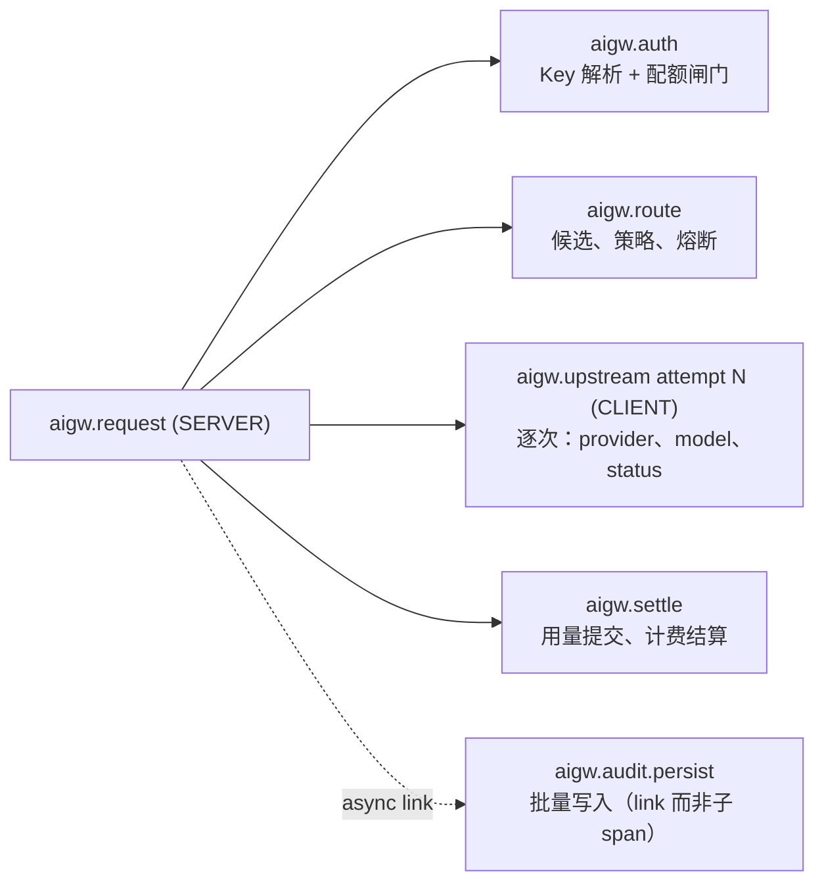

# D05 · 可观测性

> [English version](../../design/05-observability.md) · [ai-gateway 文档套件](../README.md)的一部分

| | |
| --- | --- |
| **阶段** | P0（指标、健康端点、看板） · P2（OTel 追踪） |
| **依赖** | —— |
| **被依赖** | [D01 路由](01-routing-and-lb.md)（`least_latency` 消费按次观测；熔断状态被导出）、[D08 控制台](08-web-console.md)仪表盘 |

## 背景

网关目前只有结构化日志（kratos `log.Helper`）和自己的审计轨迹——除此之外什么都没有。没有 `/metrics`、没有 `/healthz`、没有 trace。运维无法回答"现在的 p99 是多少"，Kubernetes 无法探测就绪，路由设计没有延迟信号可消费。审计日志是*业务*记录；它既达不到指标级的查询速度，也接不上基础设施工具链。本文补上第三条腿。

边界规则：**审计回答"Key X 干了什么"；指标回答"系统表现如何"；追踪回答"这个请求为什么慢"。** 数据独立流入三者；谁也不替代谁。

## 指标（P0）

### 技术栈

`prometheus/client_golang`，暴露在可配置的**独立监听端口**（`server.metrics.addr`，默认 `:9090`）——代理端口面向不受信客户端；指标不能同口。作为 Kratos server 与 HTTP 并列注册在 `internal/server/server.go`。

### 指标清单

前缀 `aigw_`。基数规则先行：标签可含 `provider`、`model`、`tenant` 与粗粒度 `status_class`——**绝不**含 `virtual_key`、`request_id` 或原始状态码。Key 级细节是审计系统的职责；一万个 Key 的部署不能给每个仪表造出一万条序列。（`tenant` 由业务约束基数；文档写明每租户序列预算，超大转售商可用开关关闭该标签。）

| 指标 | 类型 | 标签 | 备注 |
| --- | --- | --- | --- |
| `aigw_requests_total` | counter | route, inbound_protocol, status_class, tenant | 全部代理流量 |
| `aigw_request_duration_seconds` | histogram | provider, model, stream | 端到端代理延迟 |
| `aigw_ttft_seconds` | histogram | provider, model | 上游首字节；仅流式 |
| `aigw_upstream_attempts_total` | counter | provider, model, outcome | outcome：success / retryable_error / fatal_error —— 支撑 [D01](01-routing-and-lb.md) 验证 |
| `aigw_failover_total` | counter | from_provider, to_provider | |
| `aigw_breaker_state` | gauge | provider | 0 关 / 1 半开 / 2 开 |
| `aigw_tokens_total` | counter | provider, model, token_class, tenant | token_class：input / output / cache_read / cache_write / reasoning |
| `aigw_cost_micro_total` | counter | provider, model, tenant | 上游成本，微积分 |
| `aigw_quota_rejections_total` | counter | dimension, tenant | dimension = 现有 `QuotaDim*` 常量 |
| `aigw_billing_rejections_total` | counter | reason, tenant | suspended / insufficient_balance |
| `aigw_concurrency_slots` | gauge | tenant | 在用槽位（来自现有 ZSET） |
| `aigw_cache_requests_total` | counter | cache_type, outcome | [D07](07-caching-strategies.md)：exact/semantic × hit/miss/bypass |
| `aigw_guardrail_actions_total` | counter | policy, action | [D06](06-security-and-guardrails.md) |
| `aigw_audit_queue_depth` / `aigw_audit_spill_total` | gauge / counter | —— | 异步管线的健康——今天的静默失败模式 |
| `aigw_key_cache_hits_total` | counter | level (l1/l2/db) | 验证缓存设计在负载下的表现 |

插桩点落在现有接缝上：中间件进出（`virtual_key_auth.go`）、`ProxyRequest` 的尝试循环、`QuotaManager` 的拒绝路径、`AuditWorker` 的队列操作——不引入新抽象，只在关节处加计数器。`RouterManager.ReportResult`（[D01](01-routing-and-lb.md)）在一次调用中同时写 Prometheus 直方图与 Redis EWMA，两套延迟视图不可能分叉。

## 健康端点（P0）

放在**主**监听端口（LB 与 k8s 探测的应该就是它们路由的端口）：

- `GET /healthz` —— 存活：进程在、事件循环响应。不查依赖（Redis 抖动不应导致 Pod 被杀）。
- `GET /readyz` —— 就绪：MySQL ping + Redis ping，各 1 s 超时，结果缓存 2 s。失败 ⇒ 503，JSON 正文指明故障依赖。优雅停机时 `readyz` 先翻 503，随后 Kratos 排水（其停机序列已处理 server drain；审计/计费 worker 的队列在停机时冲刷——值得加一个显式的排水超时配置）。

两个端点绕过认证中间件，且不计入审计与指标请求计数。

## Grafana 看板（P0）

以 JSON 形式入仓 `deploy/grafana/`，由 docker-compose 栈自动 provision（[D10](10-deployment-and-ops.md)）：

1. **网关总览** —— RPS、错误率、p50/p95/p99、TTFT、在途并发、审计队列深度。
2. **提供方** —— 按提供方的延迟/尝试/故障转移、熔断状态时间线、Token 吞吐。
3. **经济** —— 按租户/模型的 Token 与成本、配额/计费拒绝、缓存命中节省。

告警规则（Prometheus 格式，同目录）：熔断打开 > 5 分钟、审计 spill 增长、readyz 抖动、p99 超 SLO、计费拒绝激增。

## OpenTelemetry 追踪（P2）

### 设计

- SDK：`go.opentelemetry.io/otel` + OTLP exporter；配置块 `observability.otlp_endpoint`（为空 = 完全禁用追踪——关闭时零开销，遵守单二进制最少依赖原则）。
- **上下文透传：** 尊重入站的 W3C `traceparent`（客户端获得贯穿网关的端到端 trace）；网关的 trace 上下文经 `traceparent` 传给上游提供方——被忽略也无害。现有请求 ID（`internal/biz/request_id.go`）作为 span 属性附加，仍是审计的关联键；审计行新增 `trace_id` 列，控制台可在日志 ⇄ 追踪间深链。
- 采样：parent-based + 可配比例（默认 1%），带强制采样调试头，仅限已认证管理主体使用。

### Span 拓扑

Span 属性尽量遵循 OTel GenAI 语义约定（`gen_ai.system`、`gen_ai.request.model`、`gen_ai.usage.input_tokens`……），任何 GenAI 感知后端都能读懂；提示词/补全*内容*绝不附到 span 上（那是审计的职责，有自己的访问控制）。

## 日志对齐（P0，小项）

- 把 `trace_id`/`request_id` 加入 kratos logger 的 `With` 上下文，让结构化日志与追踪、审计可关联。
- 项目已有日志级别惯例（CLAUDE.md）；补一个目前缺失的 `log.level` 配置项。

## 涉及代码

| 位置 | 变更 |
| --- | --- |
| `internal/observability/`（新增） | 指标注册表 + 仪表定义、otel 初始化、就绪检查器 |
| `internal/server/http.go` / `server.go` | 指标监听、healthz/readyz 路由、中间件插桩 |
| `internal/middleware/virtual_key_auth.go` | 请求计数/直方图挂钩 |
| `internal/biz/gateway.go`、`quota.go`、`audit.go`、`router.go` | 上表所列接缝处的计数器 |
| `internal/conf/conf.go` + `configs/config.yaml` | `observability` 块（指标地址、otlp 端点、采样比例、日志级别） |
| `deploy/grafana/`、`deploy/prometheus/`（新增） | 看板、告警规则、抓取配置 |
| `cmd/server/wire.go` | 提供可观测性组件；重新生成 |

## 测试与验证

- 单元：基数守卫——测试遍历已注册仪表，任何标签集合包含禁用键即失败。
- 集成：在 D01 故障转移测试期间抓取 `/metrics`，断言 `aigw_failover_total` 递增、`aigw_breaker_state` 迁移可见。
- 停掉 Redis 后 `readyz` 在缓存窗口内翻 503，恢复后翻回 200。
- P2：黄金 trace 测试——一次流式请求产生上述 span 拓扑，GenAI 属性填充完整。

## 实现笔记（ADR 附录）

**刚启动（或空闲）的实例抓取 `/metrics` 看起来很稀疏，这是设计使然，不是 bug。** 除了 `aigw_audit_queue_depth`/`aigw_concurrency_slots` 之外，上面列的每个 `aigw_*` 指标都是 `*Vec`（`CounterVec`/`HistogramVec`/`GaugeVec`）；client_golang 的行为是：某个标签组合在被 `.WithLabelValues(...)` 实际调用之前，根本不会产生对应的时间序列——`aigw_requests_total` 要等到至少有一次代理请求完成才会出现，`aigw_breaker_state` 要等到熔断器被触碰过一次才会出现，以此类推。这一点曾让一位运维在刚启动、还没有任何流量的实例上抓取 `/metrics`，结果只看到两个无标签的普通 gauge 而感到困惑；一旦真实流量开始流动，这个现象会自然消失——这也不是本项目 `NewMetrics` 试图去规避的问题（提前把所有可能的标签组合都注册一遍并不现实，provider/model/tenant 的取值都是动态的）。

**标准的 Go 运行时和进程指标此前缺失，这一点*确实*是个真实的缺口。** `internal/observability/metrics.go` 自建了一个独立的 `prometheus.NewRegistry()`（刻意与 `prometheus.DefaultRegisterer` 隔离，这样测试就能构造互不干扰的独立 `Metrics` 实例），而不是走一个普通 `promhttp.Handler()` 默认会用的全局注册表——和全局注册表不同，全新的 `prometheus.NewRegistry()` **不会**自动带上大多数 Prometheus 用户默认会期望任何 Go 服务都具备的 Go 采集器（`go_goroutines`、`go_gc_duration_seconds`、`go_memstats_*` 等）或进程采集器（`process_cpu_seconds_total`、`process_resident_memory_bytes`、`process_open_fds`、`process_start_time_seconds` 等）。`NewMetrics` 现在会显式注册 `collectors.NewGoCollector()` 和 `collectors.NewProcessCollector(...)`（`prometheus/client_golang/prometheus/collectors`），并在传入了 `*gorm.DB` 时额外注册 `collectors.NewDBStatsCollector(sqlDB, "primary")`（连接池的打开/使用中/空闲连接数、等待次数/耗时，取自 `database/sql` 自身的 `DBStats`）——这三者在第一次抓取时就会出现，哪怕应用层还完全没有流量。为此 `NewMetrics` 新增了一个 `db *gorm.DB` 参数（对 nil 安全：`db` 为 nil，或其 `.DB()` 报错，只会跳过 DB 连接池采集器，不会让构造失败）——`cmd/server/wire_gen.go` 直接把已经构造好的 `db` 传进去即可，因为它本来就在 `NewMetrics` 被调用之前就已经构造完成，不需要调整顺序。
