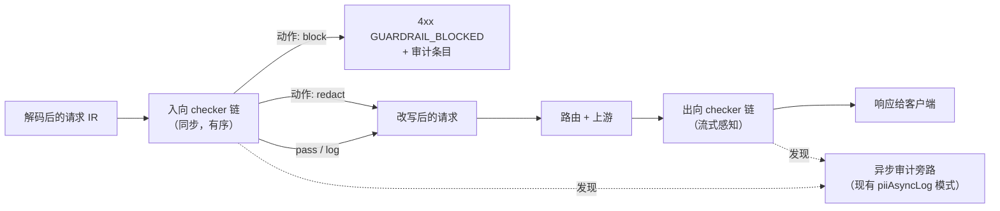

# D06 · 安全与护栏

> [English version](../../design/06-security-and-guardrails.md) · [ai-gateway 文档套件](../README.md)的一部分

| | |
| --- | --- |
| **阶段** | P0（提供方 Key 加密） · P1（内置 PII 引擎） · P2（护栏管线、外部引擎） |
| **依赖** | [D09 可扩展性](09-extensibility.md)与本文共享 checker/hook 形态（护栏是第一个内部消费者） |
| **被依赖** | [D08 控制台](08-web-console.md)安全总览 |

## 背景

已有的是一个 PII 策略*框架*：`applyPIIPolicy()`（`internal/biz/pii.go:38`）已接入代理路径，定义了三种动作（`PIIActionBlock` / `PIIActionRedact` / `PIIActionLog`），有异步审计旁路（`piiAsyncLogKey`，在 `writeAuditLog` 中以 200 ms 等待消费），还有策略模型（`internal/data/model/pii_policy.go`）。缺的是：它什么都检测不到——桩代码永远放行。

同样在本文范围内的，是差距分析中最尖锐的安全缺陷：`AIProvider.APIKey` 是**明文 varchar**（`internal/data/model/provider.go:25`），而虚拟 Key 享有 AES-256-GCM。今天一次数据库导出就会泄漏全部上游凭证。

## P0 · 密钥加固

### 提供方 API Key 加密

完全复用虚拟 Key 的做法（`internal/pkg/aes.go`）：加密存储，提供方加载时解密。迁移：启动时一次性把遗留明文行加密（按前缀/格式可检测），随后清空明文。解密后的 Key 只存在于提供方快照缓存中，绝不进日志或 API 响应（模型已标注 `json:"-"`）。

### 加密密钥生命周期

单一 32 字节 `system.encryption_key` 增加：(a) 支持经环境变量 / 文件路径提供（compose 与 k8s secret 需要——见 [D10](10-deployment-and-ops.md)）；(b) 文档化的**换钥流程**：`server rekey -old KEY -new KEY` CLI 子命令，在一个事务内重加密虚拟 Key、提供方 Key 与 admin Key。密钥*多版本*（多把并存）刻意推迟——现实行数下换钥停机只有数秒。

### 审计正文加密（P1，可选开启）

提示词/响应正文（`audit_log_bodies` 表）是静态存储中最敏感的数据。可选开关 `audit.encrypt_bodies`：按行 AES-GCM，使用系统密钥。权衡写明：加密后的正文不参与 ES 全文索引——部署方按自己的合规姿态在"可检索"与"静态加密"之间选择。（无论如何，ES 侧加密都是部署方的责任。）

## 护栏管线

一条管线统一 PII、提示注入、话题围栏与未来的检查，取代 N 条各自为政的旁路：



```go
// internal/biz/guardrail/checker.go
type Checker interface {
    Name() string
    // Check 检查（并可改写）内容。Direction: inbound|outbound。
    Check(ctx context.Context, c *Content, dir Direction) (Finding, error)
}
// Finding：action（none|log|redact|block）、types（[]string，如 "id_card","injection"）、details 供审计。
```

- **链配置**按策略：有序的 checker 名单及各自设置，存放在现有 `AIPIIPolicy` 模型泛化后的 `ai_guardrail_policies`（保留原表，加 `checker_chain json`）。策略绑定到租户/项目/Key，最具体者胜出。
- **同步 vs 异步：** checker 声明模式。可 `block` 的 checker 同步运行（受链级截止时间约束，默认 100 ms——超时 ⇒ 按策略可配失败开放/关闭，默认失败开放并记一条 `log` 发现）。仅记录型 checker 走现有异步旁路，永不触碰延迟。
- **流式出向：** checker 看到的是（来自 [D02](02-protocol-adapters.md) 流事件的）解码文本滑动窗口，只能 `log` 或**终止**（注入方言正确的错误事件并关闭）——按定义，对已发出字节的中途脱敏是不可能的。
- 故障收容：checker 的 `error`（区别于发现）被记录、计数（`aigw_guardrail_actions_total{action="error"}`），并按策略的失败开放/关闭标志处理——一条写坏的正则不能打挂代理。

## 内置 checker

### P1 · `pii_rules` —— 规则式 PII，零依赖

开箱即用、离线、中英文场景皆可：

- 检测器：正则 + 有校验位处校验（中国身份证含校验位、中国手机号、银行卡 Luhn、邮箱、IPv4/6、护照格式、通用 API Key/密钥模式），外加每策略可配的自定义模式列表。
- 脱敏：保持类型形状的掩码（`110***********1234`），下游模型保留上下文形状。
- 检测目标是 IR 的消息*文本部分*——不是原始 JSON——脱敏永远不会破坏键名/结构（这正是管线消费 [D02](02-protocol-adapters.md) IR 而非请求体的原因）。

明确定位为*规则级*：对结构化标识符强，对自由文本 PII（姓名、地址）盲。这种诚实会把严肃的合规用户推向：

### P2 · `external` —— 远程引擎适配器

一个调用外部检测服务的 checker（gRPC 优先，HTTP 兜底），发送内容窗口、返回发现——可对接 Microsoft Presidio、云 DLP API 或自研引擎。超时/失败策略遵循链规则；结果可按内容哈希缓存，应对重复提示词。

### P2 · `prompt_injection` 与 `topic_fence`

- `prompt_injection`：分层——零成本的启发式签名列表（已知越狱/系统提示词外泄模式），可选 LLM 裁判模式：把*可疑窗口*路由给设置中指定的廉价模型，**经网关自身**调用（settings 中指定提供方 + 虚拟 Key——自举，全程审计，复用路由/计费）。
- `topic_fence`：话题允许/拒绝列表，经与配置示例短语的 embedding 相似度实现（与 [D07 语义缓存](07-caching-strategies.md)共享 embedding 基础设施）；LLM 裁判可选，机制同上。

两者都保守地默认关闭：启用一个 checker 是策略决定，绝不是默认惊吓。

## 数据模型变更

| 表 | 变更 |
| --- | --- |
| `ai_providers` | `api_key` → 静态加密（同列，内容加密 + 启动迁移） |
| `ai_pii_policies` → 泛化 | 加 `checker_chain json`、`fail_mode varchar(8)`、`scope_tenant_id/project_id/key_id` |
| `ai_gateway_audit_logs` | 现有 `pii_action`/`pii_types` 泛化为护栏发现（加法式 `guardrail_findings json`；遗留列保持同步） |

## 涉及代码

| 位置 | 变更 |
| --- | --- |
| `internal/pkg/aes.go` | 不变；复用于提供方 Key + 换钥 CLI |
| `cmd/server/main.go` | `rekey` 子命令 |
| `internal/biz/guardrail/`（新增） | 管线、checker 注册表、内置 checker |
| `internal/biz/pii.go` | `applyPIIPolicy` 成为管线入口；异步旁路与动作常量保留 |
| `internal/biz/gateway.go` | 响应/流路径上的出向链挂钩 |
| `internal/biz/errors.go` | `ErrGuardrailBlocked`（kerrors 400，reason `GUARDRAIL_BLOCKED`，metadata：checker、types） |

## 测试与验证

- 每个检测器的语料测试：带标注的正/负样本集（含校验位边界——格式正确但校验位错误的身份证不得命中）；精度回退即 CI 失败。
- 脱敏往返：脱敏后的 IR 对每种出口方言都能重编码为合法的提供方 JSON。
- 链语义：超时遵循失败模式；checker panic 被收容；block 短路后续 checker。
- 流式：注入的终止事件对每种入口编解码器都方言正确。
- 安全评审门槛（[路线图](../03-roadmap.md) P0-4）：数据库导出不含任何明文上游凭证。

## 实现笔记（ADR 附录）

> 注：本文档英文版的 P2 管线落地细节（第一、二轮 ADR）尚未回填到中文版；以下第三轮是本轮新增内容的完整翻译。
>
> **运维提示——流式护栏是"尽力而为"，不是硬性拦截。** `gateway.go` 会先 `WriteHeader(200)` 并开始向客户端刷出 SSE 分块，之后 `guardrailStreamWriter` 才有足够的累积文本可供重新扫描并产生命中——这是流式提交规则（`backend/CLAUDE.md`："一旦有字节发往客户端，不再故障转移、不再重试、不再改写"）所要求的，若不缓冲整个响应就无法规避，而缓冲又会失去流式本身的意义。实际影响是：一旦命中 block/terminate 级别的检测结果，响应的*后续*部分会被拦下，但更早的分块——很可能就包含触发该命中的内容本身——已经离开网关，无法收回。非流式请求没有这个缺口（`applyOutboundGuardrail` 会在写出任何字节之前完整跑完）。如果部署方有"被拦截的响应绝不能有任何片段泄漏给客户端"这类硬性合规要求，应当对相关策略关闭流式，或者把流式检测链当作叠加在更严格的入站策略之上的检测/审计安全网，而不是唯一防线。

### 第三轮：`AIPIIPolicy` 管理 CRUD + 控制台检测链构建器

补上[控制台设计文档](08-web-console.md)早已在其接口表里预留（`guardrail-policies` 路由）、但此前完全没有后端支撑的"控制台 UI"缺口——`resolvePIIPolicy`/`buildChainForPolicy` 此前只能读一条由人工直接写入数据库的策略。

- **路由是 `/ai/gateway/pii-policies`，不是 `/ai/gateway/guardrail-policies`。** 表仍叫 `ai_pii_policies`（第一轮 ADR 已决定不改表名），所以管理路由跟着表/资源命名，而不是跟着这条管线更新的营销名字——和本项目一贯的 CRUD 路由命名习惯一致（`/model-items`、`/price-tables` 等按资源命名，不按功能故事命名）。控制台页面标题/文案仍然是"防护策略"（`GuardrailPolicies.tsx`，i18n key 为 `guardrailPolicies`/`navManage`），因为这是面向运维人员的概念；只有 URL 和设计文档的示意不同。
- **`internal/biz/pii_policy_admin.go`**（沿用 `mcp_admin.go` 的写法）：Create/List/Update/Delete，全局对象姿态（仅平台管理员可写），和本代码库其他管理资源一致。有两处不是通用 CRUD 模板能覆盖的行为：`ListPIIPolicies` 通过对 `ai_virtual_keys` 做 `COUNT(*) ... GROUP BY pii_policy_id`，回填此前定义了但一直是零值的 `BoundKeyCount` 字段；Create/Update 在一个数据库事务里强制**最多只有一条 `isDefault=true` 的策略**（先把其他所有行的该标志清零）——`resolvePIIPolicy` 的默认策略回退查询一直假设"恰好存在一条默认策略"，此前没有任何机制阻止运维人员创建两条，那样"到底哪条是默认策略"就取决于未定义的查询顺序。
- **控制台的检测链构建器是加/删，不是拖拽排序**——这是相对于（[D01](01-routing-and-lb.md)）模型映射故障转移链编辑器的一个刻意的不对称设计。故障转移链的"顺序"就是它存在的全部意义（先试的候选先被尝试）；检测链的顺序则没那么重要（每个 checker 都是独立地按链级 `policy.Action` 判定放行/拦截/脱敏），所以为第二个列表也接入 `@dnd-kit` 被认为不值得——加到末尾加一个删除按钮就够用了。每种 checker 都有自己的设置卡片：`pii_rules` 渲染一个检测项复选框网格（`cn_id_card`/`cn_mobile`/`bank_card`/`email`/`ipv4`/`api_secret`，与 `pii_engine.go` 的检测器列表逐一对应）外加旧版 `promptInjection` 复选框；`prompt_injection`、`topic_fence`（逗号分隔的禁止话题输入框）和 `external`（目标地址 + 超时毫秒数）各自渲染各自的设置结构，逐字段对应 `guardrail_pipeline.go` 的 `checkerConfig`/`*Settings` 结构体，确保控制台不会和后端真正解析的内容脱节。
