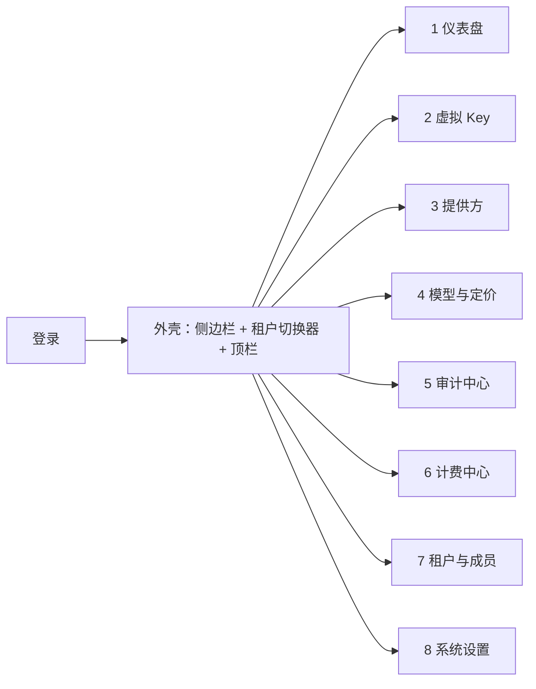

# D08 · Web 控制台

> [English version](../../design/08-web-console.md) · [ai-gateway 文档套件](../README.md)的一部分

| | |
| --- | --- |
| **阶段** | P1（MVP：模块 1–3、5 + 登录） · P2（模块 4、6、7、8） |
| **依赖** | [D04 认证/RBAC](04-multi-tenancy-and-auth.md)（登录、角色）、[D03 计费](03-billing-and-monetization.md)、[D05 可观测性](05-observability.md)、[D01 路由](01-routing-and-lb.md) |
| **被依赖** | ——（按设计原则 4 *headless 优先*，它只是公开 API 的客户端） |

## 背景

网关目前只有 API。评估者先看控制台再读 API 文档；运维需要看到熔断状态和余额，而不是去查 Redis。控制台的契约：**它执行的每个动作都必须能通过文档化的管理 API 完成**——零私有端点（P1 出口标准）。它是参考客户端，这同时也让 API 保持诚实。

## 技术选型（ADR）

- **背景：** 必须装进单二进制、能被以 Go 为主的社区维护、从第一天起支持中英双语。
- **决策：** React 18 + TypeScript + Vite、shadcn/ui（+ Tailwind）、TanStack Query + Router、Recharts 图表、react-i18next（en/zh 资源文件，遵循路线图不变量 5）。源码放 `web/`；`make build` 执行 Vite 构建并经 Go `embed.FS` 内嵌 `web/dist`，由 Kratos HTTP server 以 `/console/` 提供并做 SPA fallback。单独 `go build`（无 Node）依然可用：空 dist 占位 + build tag 让纯 API 用户的二进制保持纯 Go。
- **否决项：** Vue（也可以，但 shadcn/React 的组件生态更大，团队据此标准化）；HTMX/服务端渲染（与图表/看板密集的 UI 不匹配）；独立部署（违反单二进制）。
- **后果：** Node 只是*构建期*依赖；CI 构建一次控制台并缓存。API base 同源（`/ai/gateway/...`），默认没有 CORS 面。

认证：`/ai/gateway/auth/login`（[D04](04-multi-tenancy-and-auth.md)）颁发的会话 cookie；每个页面遵循角色矩阵——UI 隐藏 RBAC 禁止的操作，API 仍是真正的执行者。

## 信息架构



全局外壳：左侧边栏（8 个模块，按角色过滤）、顶栏含租户切换器（平台管理员看全部租户；其他人看自己的成员关系）、分析视图共享的时间范围选择器、语言切换、用户菜单。所有列表视图共享同一模式：服务端分页、与 API 查询参数一一对应的列过滤、当前过滤条件的 CSV 导出。

---

### 1 · 仪表盘

```text
┌─────────────────────────────────────────────────────────────────┐
│ [时间范围 ▾]                                        [自动刷新] │
│ ┌────────┐ ┌────────┐ ┌────────┐ ┌────────┐ ┌────────┐         │
│ │请求数  │ │错误率  │ │p95 ms  │ │Token   │ │成本    │  KPI    │
│ └────────┘ └────────┘ └────────┘ └────────┘ └────────┘         │
│ ┌───────────────────────────┐ ┌───────────────────────────┐    │
│ │ 请求与错误（折线）        │ │ 成本与 Token（堆叠柱）     │    │
│ └───────────────────────────┘ └───────────────────────────┘    │
│ ┌─────────────┐ ┌─────────────┐ ┌──────────────────────────┐   │
│ │ Top 模型    │ │ Top Key     │ │ 提供方健康带：           │   │
│ │ （柱状）    │ │ （柱状）    │ │ ● openai ● azure ◐ dash  │   │
│ └─────────────┘ └─────────────┘ └──────────────────────────┘   │
└─────────────────────────────────────────────────────────────────┘
```

交互：每个图表分段点击即跳转到预置过滤的审计列表；健康点打开提供方详情与熔断时间线。数据：**新增** `GET /ai/gateway/stats/overview` + `GET /ai/gateway/stats/timeseries`（服务端从 `ai_usage_daily` + 审计聚合；控制台从不抓 Prometheus——基础设施视图归 Grafana，控制台呈现*业务*视图）。

### 2 · 虚拟 Key

```text
┌ Key 列表 ─────────────────────────────────────── [+ 创建 Key] ┐
│ 过滤: 项目 ▾ 状态 ▾ 搜索…                                     │
│ 名称      项目   状态   配额使用        过期      ⋯           │
│ team-a    core   ●启用  ▓▓▓▓▓░░ 68%/日  2026-12   [⏻][✎]     │
│ ci-bot    infra  ○停用  ░░░░░░░  0%     永不      [⏻][✎]     │
└────────────────────────────────────────────────────────────────┘
详情抽屉: 概览 | 配额 | 模型 | 安全 | 用量
```

- **创建向导**（3 步）：① 基本信息（名称、项目、过期）→ ② 配额（按维度输入，预填项目模板；按模型覆盖表格）→ ③ 访问控制（模型白名单选择器、带 CIDR 校验的 IP 白名单、缓存/护栏策略选择器）。成功后明文 `sk-vk-*` 在复制弹窗中**只展示一次**（之后的取回需要 Owner/Admin 的 `reveal` 操作，且记入操作者审计）。
- 详情抽屉各标签页对应：`GET key/quota-config`、`PUT key/quota-config`、`GET key/quota-usage`（Redis 窗口的实时仪表）、按 Key 过滤的用量图表。
- API：现有 CRUD（`POST/PUT/DELETE /ai/gateway/key`、`.../list`、`.../stats`、`.../reveal`、`.../status`、配额端点）。**新增：** MVP 无需——这个模块正是现有管理 API 的用武之地。

### 3 · 提供方

```text
┌ 提供方 ──────────────────────────────────────── [+ 添加] ─────┐
│ 名称     类型       健康        权重    P95    模型数  ⋯      │
│ openai   openai_c   ● 关闭      ▓▓▓ 60  820ms  14      [✎]   │
│ azure    azure_oai  ◐ 半开      ▓░░ 30  1.2s   9       [✎]   │
│ dash     openai_c   ○ 打开      ▓░░ 10  —      22      [✎]   │
│ ── 降级链 ───────────────────────────────────────────────────  │
│ gpt-4o:  openai → azure → dash:qwen-max            [编辑链]   │
└────────────────────────────────────────────────────────────────┘
```

- 健康列 = 实时熔断状态（**新增** `GET /ai/gateway/providers/health`，读 `RouterManager`）；点击打开熔断事件时间线（来自 `ai_gateway_router_events`）。
- 权重行内编辑（滑杆 + 数字）；降级链编辑器是提供方+模型对的有序拖拽列表，写入映射上的 `fallback_chain`（[D01](01-routing-and-lb.md)）。
- 每个提供方的"同步模型"按钮 → **新增** `POST /ai/gateway/providers/{id}/sync-models`（拉取上游 `/models`，与 `AIModelItem` 做 diff）。
- 提供方表单按 `ProviderType` 渲染类型特有的 `adapter_config` 字段（[D02](02-protocol-adapters.md)）；API Key 输入只写不回显。
- API：**新增**提供方 CRUD（`/ai/gateway/providers`…）——今天提供方只能直接操作数据库；这个模块把缺失的端点逼进公开 API。

### 4 · 模型与定价（P2）

模型目录（按提供方：名称、成本价、启用状态）· 价格表编辑器（售价侧，见 [D03](03-billing-and-monetization.md)：表列表 → 条目网格，含正则模式列与**模式测试器**——实时显示哪些已知模型会被匹配，语义与映射匹配器一致）· 模型映射管理器，带同款正则测试器。API：**新增** `/ai/gateway/model-items`、`/ai/gateway/price-tables`、`/ai/gateway/model-mappings` CRUD。

### 5 · 审计中心

```text
┌ 审计 ── [日志] [会话] [安全] ──────────────────────────────────┐
│ 过滤: key ▾ 提供方 ▾ 模型 ▾ 状态 ▾ 时间 ▾ 搜索                │
│ 时间     KEY     模型    提供方  TOK(入/出)  ms   状态 缓存 PII│
│ 10:32:01 team-a  gpt-4o  openai  1.2k/310    840  200  —   —  │
│ 10:31:58 ci-bot  gpt-4o  azure   0.9k/120    620  200  hitX — │
│ ▸ 行展开: 尝试轨迹 (openai ✗429 → azure ✓)、trace id、        │
│   [查看正文]（角色门控，惰性加载 audit_log_bodies）           │
└────────────────────────────────────────────────────────────────┘
```

- **日志**页：现有 `GET /ai/gateway/audit/list`；正文查看器惰性加载，将 chat 消息渲染为对话形式，高亮脱敏标记。
- **会话**页：现有 `GET /ai/gateway/audit/sessions` —— 会话分组与聚合，可展开到成员请求。
- **安全**页：现有 `GET /ai/gateway/audit/security-overview`，扩展护栏发现的细分（[D06](06-security-and-guardrails.md)）：按类型/动作的发现随时间分布、Top 违规 Key、点击穿透到日志。

### 6 · 计费中心（P2）

按租户：余额卡（余额、冻结、模式、状态含宽限期倒计时）+ `[充值]`（金额 → 支付方式 → 支付单 → 二维码/跳转 → 轮询单状态）· 流水表（类型、金额、变动后余额、出处链接——一条 `deduct` 链接到它的审计行）· 套餐与订阅卡 · 发票列表（按期生成 → 行项目来自 `ai_usage_daily`）· 预算告警配置（低水位 + 通道）。API：[D03](03-billing-and-monetization.md) 的端点面（`/ai/gateway/billing/accounts|ledger|plans|subscriptions|orders|invoices`）。

### 7 · 租户与成员（P2）

平台管理员：租户列表/创建、按租户的状态与价格表绑定。租户 Owner：项目树（创建/编辑项目、配额模板）、成员列表（邮箱邀请，角色下拉遵循 [D04](04-multi-tenancy-and-auth.md) 矩阵）、admin API key 管理（创建 → 只展示一次，作用域 + 角色）。同时呈现操作者活动日志（`ai_admin_audit_logs`）。

### 8 · 系统设置（P2）

全局路由默认（策略、重试预算）· 护栏策略编辑器（checker 链构建器，逐 checker 配置表单）· 缓存全局配置 · 通知通道（webhook URL、SMTP）带测试发送 · 积分汇率编辑（现有 `ai_credits_rates`）· 关于/版本/许可证。

---

## 控制台逼出的新 API 端点

控制台是这些公开新增端点的需求方（全部遵循现有信封 + 命名约定）：

| 端点组 | 支撑设计 |
| --- | --- |
| `GET /ai/gateway/stats/overview`、`/stats/timeseries` | [D03](03-billing-and-monetization.md) `ai_usage_daily` |
| `/ai/gateway/providers` CRUD + `/health` + `/sync-models` | [D01](01-routing-and-lb.md) |
| `/ai/gateway/model-items`、`/price-tables`、`/model-mappings` CRUD | [D03](03-billing-and-monetization.md) |
| `/ai/gateway/tenants`、`/projects`、`/users`、`/auth/*`、`/admin-keys` | [D04](04-multi-tenancy-and-auth.md) |
| `/ai/gateway/billing/*` | [D03](03-billing-and-monetization.md) |
| `/ai/gateway/guardrail-policies`、`/cache`（清空）、`/settings` | [D06](06-security-and-guardrails.md)、[D07](07-caching-strategies.md) |

## 涉及代码

| 位置 | 变更 |
| --- | --- |
| `web/`（新增） | SPA 本体 |
| `internal/server/http.go` | `/console/` embed.FS 处理器 + SPA fallback；新 API 路由 |
| `internal/service/*.go` | 新端点组的 handler（保持薄，遵循分层规则） |
| `Makefile` / CI | `web-build` 目标；embed 占位 build tag |

## 测试与验证

- CI 中对 compose 栈跑 Playwright E2E：登录 → 建 Key → 发一条代理请求（脚本化）→ 在审计中看到 → 核对仪表盘计数。P1 转售商出口流程（[路线图](../03-roadmap.md)）是第二条脚本化 E2E。
- 契约检查：控制台的 API 客户端由 OpenAPI 规范（[D10](10-deployment-and-ops.md)）生成；控制台调用了规范之外的端点即 CI 失败——机械地强制"零私有端点"。
- RBAC 快照测试：每种角色渲染正确的导航与操作集合。

## 实现笔记（ADR 附录）

实际落地的技术栈比上面的 ADR 决定的要朴素得多（没有 shadcn/ui、没有 Tailwind、没有 TanStack Query/Router、没有 Recharts、没有 react-i18next——取而代之的是手写的 "Signal Terminal" 设计系统与无依赖的 `i18n.ts`/`useAsync`，见 `frontend/CLAUDE.md` 的"技术栈与结构"一节）；这一分歧早于本轮就已存在，这里不再重新讨论。本附录只覆盖本轮（故障转移链编辑器、检测链构建器、缓存/向量模型配置、用量图表）针对上述计划实际落地的部分：

- **接口命名是 `/ai/gateway/pii-policies`，不是本文档接口表里的 `/ai/gateway/guardrail-policies`。** 后端表是 `ai_pii_policies`（[D06](06-security-and-guardrails.md) 第一轮 ADR 已决定不改表名），所以路由跟着资源名走，和本代码库其他 CRUD 路由的命名习惯一致（`/model-items`、`/price-tables` 等）。控制台页面文案仍然是"防护策略"。
- **模型映射和防护策略各自是独立的顶级页面**（`ModelMappings.tsx`、`GuardrailPolicies.tsx`），而不是像模块 3/8 的示意图那样折叠进 Providers 页面的"故障转移链"条或 Settings 的子 Tab——实际的控制台导航按操作/管理/观察三个分组（`frontend/CLAUDE.md`），这两个页面作为管理分组下的独立列表 CRUD 页面，和该分组下其他资源（MCP 服务器、模型与价格表）保持一致。
- **故障转移链的编辑放在模型映射页面，而不是内嵌在 Providers 页面**——真正拥有 `fallback_chain` 的是映射（`AIModelMapping`，归属于某个虚拟 Key），不是 provider；模块 3 示意图里 `gpt-4o: openai → azure → dash:qwen-max` 内嵌在 provider 表格下方的画法把两个资源混在了一起。`ModelMappings.tsx` 把虚拟 Key 选择器、映射表格与一个 `@dnd-kit` 拖拽编辑器组合在一起，对应 [D01](01-routing-and-lb.md) 的 ADR 附录。
- **创建 Key 时的缓存/防护策略选择器是两个普通表单字段，不是三步向导。** 设计里模块 2 画的是"① 基础信息 → ② 配额 → ③ 访问"三步向导；实际落地是把缓存配置字段组和防护策略下拉框直接加到既有的单页创建表单（`Keys.tsx`）里，和该表单上其他字段组的做法一致——没有引入多步流程。
- **用量页面**（`Usage.tsx`，观察分组）：一个 7/14/30/90 天范围选择器，驱动四个单序列 `AreaChart`（请求数、输入 Token、输出 Token、计费积分），数据来自既有的 `GET /ai/gateway/stats/timeseries`。按模型/按 Key 拆分和缓存命中率序列本来也在考虑范围内，但被砍掉了——`UsageTimeseries` 不按模型/Key 分组，也不按天返回缓存命中数（只有 `UsageOverview` 的 top-models 列表才有），补上这个分组是后端改动，超出了一个纯前端页面的范围。
